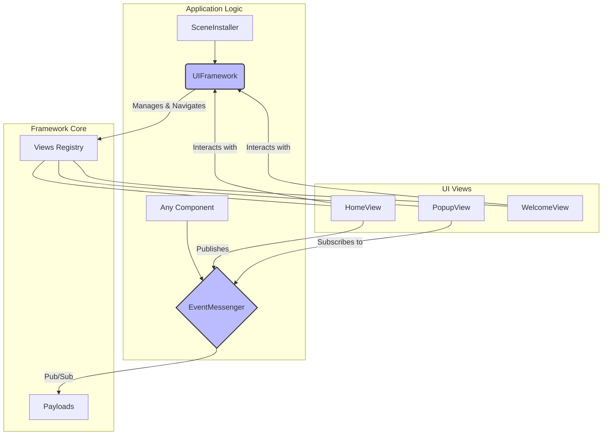
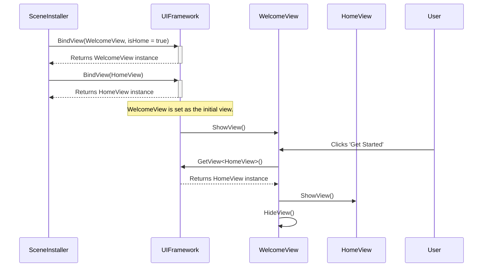
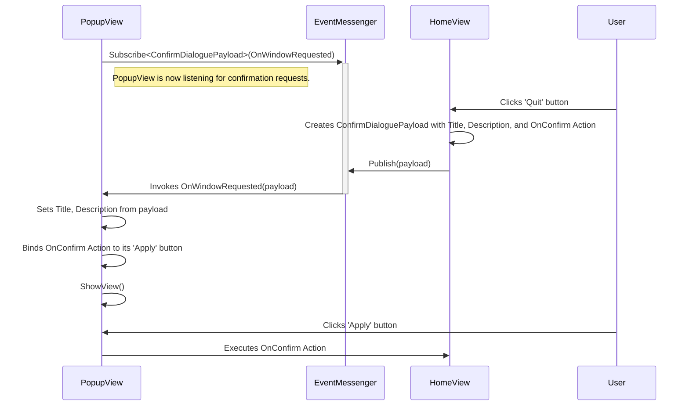

# Architecture Documentation

This document outlines the software architecture of the UI and event management systems. It is intended for senior developers who need to understand, maintain, and extend the framework.

## Core Concepts

The architecture is built upon two primary pillars: a centralized **UI Manager (`UIFramework`)** and a decoupled **Event Bus (`EventMessenger`)**. This combination provides both structured, history-based navigation and flexible, system-wide communication, allowing different UI components to interact without being directly aware of each other.

### 1. UIFramework

The `UIFramework` is a static class that acts as the central nervous system for UI management. It is responsible for the entire lifecycle of views, including registration, navigation, and history management.

-   **View Management**: The framework maintains a registry of all available views (`IBaseView` implementations). Views are typically instantiated and registered at application startup (e.g., in a `SceneInstaller`).
-   **Navigation**: It manages a `viewHistory` list that functions as a navigation stack. This allows for straightforward `GoBack()` functionality.
-   **State Control**: It controls which view is currently active, ensuring that only one primary view is displayed at a time while allowing for global "overlay" views (like popups and loaders).

### 2. EventMessenger

The `EventMessenger` is a singleton-based event bus that facilitates a publish-subscribe communication model. It allows any part of the application to broadcast a message (a "payload") that other parts can listen and react to.

-   **Decoupling**: The primary benefit is decoupling. A view can request a confirmation popup without needing a direct reference to the `PopupView` class. It simply publishes a `ConfirmDialoguePayload`, and the `PopupView`, which subscribes to this payload type, handles the request.
-   **Typed Payloads**: Communication is type-safe. Payloads are strongly-typed classes, preventing runtime errors and making the data contract between publishers and subscribers explicit.
-   **Callbacks**: Payloads can contain `Action` delegates, allowing the publisher to inject behavior directly into the handler (e.g., providing the `OnConfirm` action for a dialog).

### 3. Views (`IBaseView`)

Views are the fundamental building blocks of the UI. They are self-contained UI screens or components (e.g., `HomeView`, `PopupView`) that inherit from a common `BaseView` class.

-   **Lifecycle**: Views have a defined lifecycle with methods like `OnViewAwake()`, `OnViewStart()`, and `OnViewDestroy()` for setup and teardown.
-   **Display Control**: They expose `ShowView()` and `HideView()` methods, which are typically invoked by the `UIFramework` during navigation or by the view itself. These methods often trigger animations.
-   **Global Views**: A view can be designated as a "global view" (`SetAsGlobalView()`). These views (e.g., `LoadingView`, `ErrorView`) are not part of the main navigation stack and can be displayed as overlays on top of any other view.

## Architecture Diagram

The following diagram illustrates the high-level relationship between the core components.

## Workflows

### View Initialization and Navigation

This workflow shows how views are registered and how navigation from one view to another is handled by the `UIFramework`.

### Decoupled Communication via EventMessenger

This workflow demonstrates how a view can trigger a global popup without holding a direct reference to the popup view.

