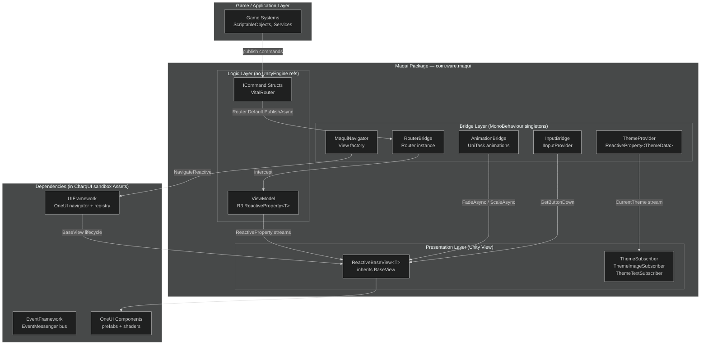
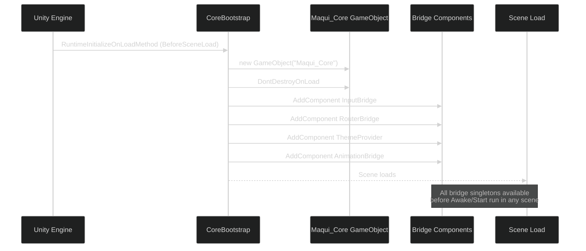
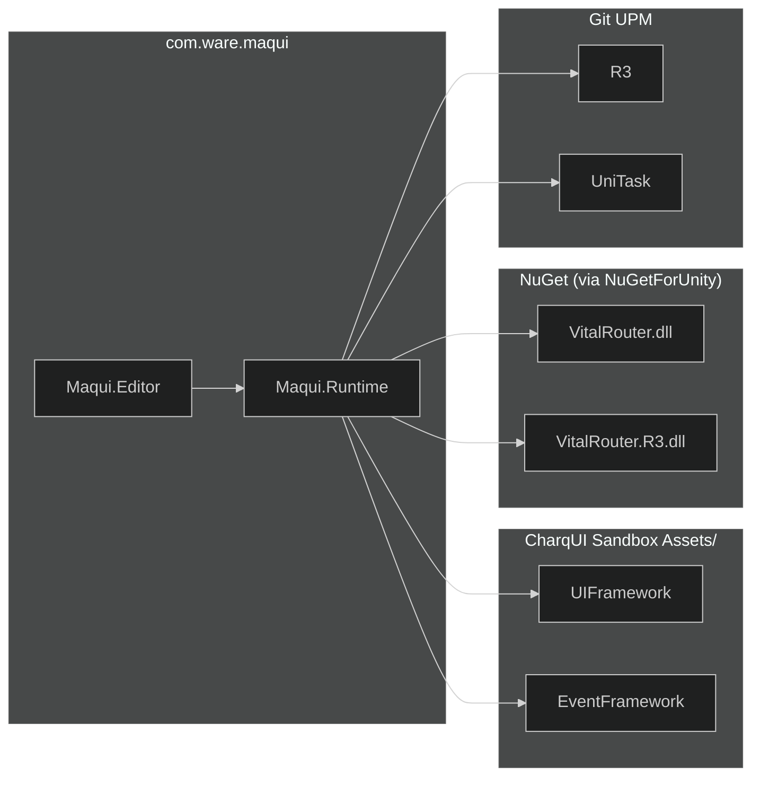

# Maqui — Architecture Reference

> **Package**: `com.ware.maqui` v0.1.0
> **Unity**: 2022.3 LTS+ | **Render Pipeline**: URP 17.x
> **Runtime deps**: R3, VitalRouter, UniTask, UIFramework (OneUI)

---

## 1. Design Philosophy

Maqui is a **reactive MVVM bridge layer** that sits between your game logic and Unity's rendering systems. It makes three hard guarantees:

1. **ViewModels have zero Unity dependencies** — they contain only C#, R3 observables, and VitalRouter commands. They can be unit-tested without entering Play Mode.
2. **The rendering layer is swappable** — your business logic never directly touches `GameObject`, `Canvas`, or `UIDocument`. Swapping uGUI for UI Toolkit requires changes only in `Presentation/`.
3. **Bootstrap is zero-config** — `CoreBootstrap` fires via `[RuntimeInitializeOnLoadMethod]` before any scene loads. You do not need a bootstrap scene, a prefab in your hierarchy, or a manually ordered Awake sequence.

---

## 2. Layer Model



---

## 3. Architectural Pillars

| Pillar | Implementation | Guarantee |
|:---|:---|:---|
| **Reactive Logic** | R3 `ReactiveProperty<T>` + `CompositeDisposable` | Zero-allocation push-based data flow. No polling. |
| **Command Bus** | VitalRouter `ICommand` + `ICommandInterceptor` | Unidirectional control flow. Async-safe navigation pipeline. |
| **Hybrid Rendering** | uGUI (visual fidelity) + UI Toolkit (data-dense lists) | Each renderer used where it excels. No forced migration. |
| **Input Abstraction** | `IInputProvider` → `InputBridge` | New Input System and Legacy Input coexist behind a single API. |
| **Zero-Config Boot** | `[RuntimeInitializeOnLoadMethod(BeforeSceneLoad)]` | No bootstrap scene. No manually ordered GameObjects. |
| **Theme System** | `ThemeData` ScriptableObject + reactive stream | Runtime theme switching with zero manual `Refresh()` calls. |

---

## 4. Class Hierarchy

```mermaid
---
config:
  theme: dark
---
classDiagram
    class ViewModel {
        <<abstract>>
        #CompositeDisposable Disposables
        +Initialize() void
        +Dispose() void
    }

    class ReactiveBaseView~T~ {
        <<abstract>>
        #T ViewModel
        #CompositeDisposable Disposables
        +Initialize(T viewModel) void
        #OnBind()* void
        +OnViewDestroy() void
    }

    class BaseView {
        <<OneUI>>
        +ShowView(DisplayOptions) void
        +HideView(DisplayOptions) void
        +OnViewDestroy() void
    }

    class ThemeSubscriber {
        <<abstract>>
        #CompositeDisposable ThemeDisposables
        #OnThemeChanged(ThemeData)* void
    }

    class ThemeImageSubscriber {
        +ThemeColorType ColorType
    }

    class ThemeTextSubscriber {
        +ThemeColorType ColorType
    }

    class RouterBridge {
        +Router Router
        +Instance$ RouterBridge
    }

    class ThemeProvider {
        +ReadOnlyReactiveProperty~ThemeData~ CurrentTheme
        +SetTheme(ThemeData) void
        +Instance$ ThemeProvider
    }

    class AnimationBridge {
        +FadeAsync(CanvasGroup, float, float, CancellationToken) UniTask
        +ScaleAsync(RectTransform, Vector3, float, AnimationCurve, CancellationToken) UniTask
        +SceneTransitionAsync(string, float, Color, CancellationToken) UniTask
        +Instance$ AnimationBridge
    }

    class MaquiNavigator {
        +NavigateReactive~TView, TViewModel~(string, Action~TView~)$ void
        +CleanupViewModel~TViewModel~()$ void
    }

    class InputBridge {
        +SetProvider(IInputProvider) void
        +GetAxis(string) float
        +GetButtonDown(string) bool
        +GetPointerPosition() Vector2
        +Instance$ InputBridge
    }

    BaseView <|-- ReactiveBaseView~T~
    MonoBehaviour <|-- ThemeSubscriber
    ThemeSubscriber <|-- ThemeImageSubscriber
    ThemeSubscriber <|-- ThemeTextSubscriber
    ViewModel <-- ReactiveBaseView~T~
```



---

## 5. Bootstrap Sequence

`CoreBootstrap.Initialize()` runs automatically via `[RuntimeInitializeOnLoadMethod(RuntimeInitializeLoadType.BeforeSceneLoad)]`. It creates a single `DontDestroyOnLoad` `GameObject` named `Maqui_Core` and attaches the four bridge components in order:



**Dependency order matters**:
- `InputBridge` must exist before any `ReactiveBaseView` that reads input in `Update`.
- `RouterBridge` must exist before any interceptor registration (samples register their own).
- `ThemeProvider` must exist before any `ThemeSubscriber` calls `Start`.

> **Do not** register sample interceptors in `CoreBootstrap`. Each sample owns its own `Initialize()` → `Router.Default.AddFilter(...)` call. The package core is decoupled from its samples.

---

## 6. Data Flow: One Reactive Cycle

The canonical Maqui data cycle from user interaction to screen update:

```mermaid
---
config:
  theme: dark
---
sequenceDiagram
    participant User
    participant View as ReactiveBaseView&lt;T&gt;
    participant VM as ViewModel
    participant Router as VitalRouter Router
    participant IC as ICommandInterceptor
    participant VM2 as Target ViewModel

    User->>View: UI Event (Button.onClick)
    View->>Router: Router.Default.PublishAsync(new MyCommand())
    Router->>IC: InvokeAsync (interceptor chain)
    IC->>IC: Async work (await UniTask.Delay / API call)
    IC->>VM2: Update ReactiveProperty
    VM2-->>View: .Subscribe stream pushes new value
    View->>View: Update label / spinner / panel
```

---

## 7. Dependency Graph



> **Note on UIFramework**: `UIFramework` and `EventFramework` are in the CharqUI sandbox `Assets/` folder, not packaged separately. `Maqui.Runtime` references them by assembly name. If you are distributing Maqui as a standalone product, these assemblies must be extracted into their own UPM package (`com.ware.oneui`) first.

---

## 8. Assembly Definitions

| Assembly | Path | `autoReferenced` | Purpose |
|:---|:---|:---:|:---|
| `Maqui.Runtime` | `Runtime/` | `true` | All runtime Core classes |
| `Maqui.Editor` | `Editor/` | `true` | Editor tooling (currently placeholder) |
| `Maqui.Tests.Runtime` | `Tests/Runtime/` | `false` | NUnit play-mode + edit-mode tests |
| `Maqui.Tests.Editor` | `Tests/Editor/` | `false` | Editor-only tests |
| `Maqui.Samples.*` | `Samples~/*/` | `false` | Per-sample, imported on demand |

Tests are gated by `UNITY_INCLUDE_TESTS` to prevent shipping test assemblies in production builds.

---

## 9. Threading Model

All Maqui operations are **main-thread safe by default**:

- R3's `ReactiveProperty` subscribers always fire on the thread that called `.Value = x`. In Unity, that is the main thread.
- `AnimationBridge` uses `await UniTask.Yield(PlayerLoopTiming.Update, ct)`, ensuring all interpolation runs in the main Unity player loop.
- VitalRouter's `Router.Default.PublishAsync` is designed to be awaited. Fire-and-forget with `.Forget()` is acceptable for navigation commands where you do not need the result.

If you publish commands from background threads (e.g., a `Task.Run` callback), use `await UniTask.SwitchToMainThread()` before calling `PublishAsync`.
