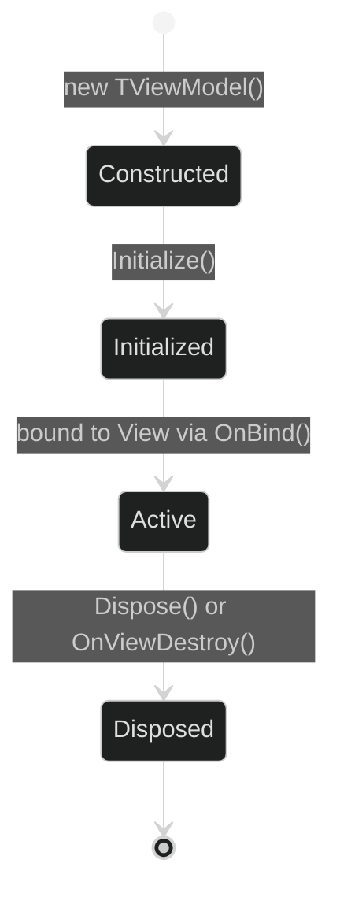

# Maqui — Core Concepts

---

## 1. ViewModel

`Maqui.Core.Logic.ViewModel` is the base class for all application state containers.

```csharp
public abstract class ViewModel : IDisposable
{
    protected readonly CompositeDisposable Disposables = new();
    public virtual void Initialize() { }
    public virtual void Dispose() { Disposables.Dispose(); }
}
```

### Lifecycle



### Reactive State Pattern

Use R3 `ReactiveProperty<T>` for any data that Views observe. Use plain fields for data that never changes after `Initialize()`.

```csharp
public sealed class InventoryViewModel : ViewModel
{
    // Observed by views — use ReactiveProperty
    public readonly ReactiveProperty<IReadOnlyList<ItemData>> Items = new(Array.Empty<ItemData>());
    public readonly ReactiveProperty<ItemData> SelectedItem = new(null);
    public readonly ReactiveProperty<bool> IsFetching = new(false);

    // Static config — plain field
    public readonly string CategoryTitle;

    public InventoryViewModel(string categoryTitle)
    {
        CategoryTitle = categoryTitle;
    }

    public override void Initialize()
    {
        // Subscribe to your own internal changes here.
        // External data loading should be triggered via commands.
        SelectedItem
            .Where(item => item != null)
            .Subscribe(item => Debug.Log($"[Inventory] Selected: {item.Name}"))
            .AddTo(Disposables);
    }

    public void Select(ItemData item) => SelectedItem.Value = item;
}
```

### Shared ViewModels (Cross-View State)

When multiple views need to react to the same state, create a shared ViewModel and inject it into each view's constructor:

```csharp
var globalState = new GlobalAppStateViewModel();

screenView.Initialize(new ScreenViewModel(globalState));
worldView.Initialize(new WorldViewModel(globalState));
// Both now react to changes in globalState.GlobalLevel, etc.
```

This is the pattern demonstrated in `Samples~/GrandTour/`.

---

## 2. ReactiveBaseView\<T\>

```csharp
public abstract class ReactiveBaseView<T> : BaseView where T : ViewModel
{
    protected T ViewModel;
    protected readonly CompositeDisposable Disposables = new();

    public virtual void Initialize(T viewModel) { ... }
    protected abstract void OnBind();
    public override void OnViewDestroy() { ... }
}
```

### Binding Rules

`OnBind()` is your only guaranteed-safe binding window. It fires synchronously during `Initialize()`, after `ViewModel.Initialize()` has returned.

```csharp
protected override void OnBind()
{
    // ✅ Safe: ViewModel is non-null, Initialize() already ran.
    ViewModel.Items
        .Subscribe(UpdateList)
        .AddTo(Disposables);

    // ✅ Safe: UI components are always ready in OnBind (prefab is fully instantiated).
    submitButton.onClick.AsObservable()
        .Subscribe(_ => ViewModel.Submit())
        .AddTo(Disposables);

    // ❌ Wrong: Don't read .Value here to set initial display.
    //           Subscribe handles the initial emission automatically (R3 BehaviorSubject semantics).
    // titleLabel.text = ViewModel.Title.Value; // don't do this
}
```

### Cleanup

`OnViewDestroy()` disposes `Disposables` and calls `ViewModel.Dispose()`. Both are automatic — you do not need to override `OnDestroy()`.

```csharp
public override void OnViewDestroy()
{
    base.OnViewDestroy();     // calls Disposables.Dispose() + ViewModel.Dispose()
    // Add any additional teardown here (e.g., object pool returns).
}
```

### Two Ways to Use ReactiveBaseView

**1. Resource-based (MaquiNavigator)**
The framework creates the ViewModel. Good for full-screen navigations.
```csharp
MaquiNavigator.NavigateReactive<ProfileView, ProfileViewModel>("Views/ProfileView");
```

**2. Manual injection**
You create and own the ViewModel. Good for sub-views and panels.
```csharp
var vm = new ProfileViewModel(userId);
profileView.Initialize(vm);
// You are responsible for calling vm.Dispose() when done.
```

---

## 3. R3 Patterns Used in Maqui

Maqui uses R3 (not UniRx). The API surface is similar but not identical.

### Subscribe + AddTo (the core pattern)
```csharp
property
    .Subscribe(value => DoSomething(value))
    .AddTo(Disposables); // auto-unsubscribe when Disposables.Dispose() is called
```

### Filtering before subscribe
```csharp
ViewModel.Error
    .Where(err => err != null)
    .Subscribe(err => ShowError(err.Message))
    .AddTo(Disposables);
```

### Combining two properties
```csharp
// Fires whenever either Name or Level changes.
ViewModel.DisplayName.CombineLatest(ViewModel.Level, (name, level) => $"{name} (Lv.{level})")
    .Subscribe(text => headerLabel.text = text)
    .AddTo(Disposables);
```

### Button click as observable
```csharp
button.onClick.AsObservable()
    .ThrottleFirst(TimeSpan.FromMilliseconds(500))   // debounce spam clicks
    .Subscribe(_ => ViewModel.OnConfirm())
    .AddTo(Disposables);
```

### Async operation result → property
```csharp
// Inside an interceptor or service:
var result = await myApiService.FetchAsync(id);
vm.Data.Value = result;   // subscribers fire automatically on the assigning thread
```

---

## 4. ThemeData & ThemeProvider

### ThemeData ScriptableObject

Create theme assets via `Assets → Create → Maqui → Theme Data`.

```csharp
// Maqui.Core.Logic
[CreateAssetMenu(menuName = "Maqui/Theme Data")]
public class ThemeData : ScriptableObject
{
    public string ThemeName;

    // Palette
    public Color PrimaryColor;
    public Color SecondaryColor;
    public Color AccentColor;

    // Backgrounds
    public Color BackgroundMain;
    public Color BackgroundOverlay;
    public Color BackgroundContrast;

    // Text
    public Color TextPrimary;
    public Color TextSecondary;
    public Color TextInverse;

    // State
    public Color Success, Warning, Danger, Info;

    // Procedural
    public float DefaultRounding;
    public float DefaultOutlineWidth;
    public float BlurStrength;

    public Color GetColor(ThemeColorType type) { ... }
}
```

### ThemeProvider (Bridge Singleton)

```csharp
// Switch theme at runtime — all ThemeSubscribers react immediately.
ThemeProvider.Instance.SetTheme(myDarkTheme);

// Read current theme imperatively (use sparingly; prefer subscription).
var current = ThemeProvider.Instance.CurrentTheme.CurrentValue;

// Subscribe to theme changes in a custom MonoBehaviour.
ThemeProvider.Instance.CurrentTheme
    .Where(t => t != null)
    .Subscribe(OnThemeChanged)
    .AddTo(_disposables);
```

### ThemeSubscriber Base Class

Extend `ThemeSubscriber` to react to global theme changes in any `MonoBehaviour`:

```csharp
public class MyButton : ThemeSubscriber
{
    [SerializeField] private Image background;
    [SerializeField] private TMP_Text label;

    protected override void OnThemeChanged(ThemeData theme)
    {
        background.color = theme.GetColor(ThemeColorType.Primary);
        label.color = theme.GetColor(ThemeColorType.TextInverse);
    }
}
```

### Built-in Subscribers

| Component | Target | Config |
|:---|:---|:---|
| `ThemeImageSubscriber` | `Image.color` | `ColorType` field (inspector) |
| `ThemeTextSubscriber` | `TMP_Text.color` | `ColorType` field (inspector) |

Attach these to any `GameObject` — no code required. They subscribe in `Start()` and unsubscribe in `OnDestroy()`.

---

## 5. MaquiNavigator

Static helper that wraps `UIFramework.LoadViewFromResources` + ViewModel lifecycle management.

```csharp
public static class MaquiNavigator
{
    // Navigate to a reactive view. Creates ViewModel if one doesn't exist for this type.
    // Reuses the existing ViewModel if NavigateReactive was called before with the same TViewModel type.
    public static void NavigateReactive<TView, TViewModel>(
        string resourcePath,
        Action<TView> onComplete = null)
        where TView : ReactiveBaseView<TViewModel>
        where TViewModel : ViewModel, new();

    // Dispose and remove the ViewModel for the given type.
    // Call this when permanently leaving a screen.
    public static void CleanupViewModel<TViewModel>() where TViewModel : ViewModel;
}
```

### ViewModel Reuse Semantics

`MaquiNavigator` maintains a `Dictionary<Type, ViewModel>`. If you navigate to a view whose ViewModel type already has an active entry, the **same ViewModel instance** is reused. This preserves state across show/hide cycles.

To reset state, call `MaquiNavigator.CleanupViewModel<MyViewModel>()` before navigating again.

```csharp
// First navigation — creates ProfileViewModel
MaquiNavigator.NavigateReactive<ProfileView, ProfileViewModel>("Views/Profile");

// User navigates away, then back — reuses existing ProfileViewModel (state preserved)
MaquiNavigator.NavigateReactive<ProfileView, ProfileViewModel>("Views/Profile");

// Force fresh state:
MaquiNavigator.CleanupViewModel<ProfileViewModel>();
MaquiNavigator.NavigateReactive<ProfileView, ProfileViewModel>("Views/Profile");
```

---

## 6. CompositeDisposable Discipline

Every subscription in Maqui must be added to either:
- `Disposables` (on `ReactiveBaseView<T>`) — cleared on `OnViewDestroy`
- `ThemeDisposables` (on `ThemeSubscriber`) — cleared on `OnDestroy`
- A local `CompositeDisposable` you manage manually

**Never** store a raw `IDisposable` as a field without disposing it. This will leak the subscription for the lifetime of the `GameObject`.

```csharp
// ❌ Leak — subscription never disposed
private IDisposable _sub;
void Start() { _sub = vm.Name.Subscribe(UpdateLabel); }

// ✅ Correct — auto-disposed via ReactiveBaseView lifecycle
protected override void OnBind()
{
    ViewModel.Name.Subscribe(UpdateLabel).AddTo(Disposables);
}

// ✅ Also correct — manual management in non-Maqui MonoBehaviour
private readonly CompositeDisposable _d = new();
void Start() { vm.Name.Subscribe(UpdateLabel).AddTo(_d); }
void OnDestroy() { _d.Dispose(); }
```
