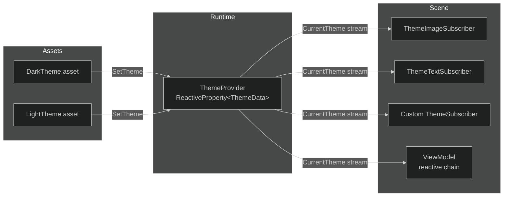

# Maqui — Theming System

---

## 1. Overview

Maqui's theme system uses a `ScriptableObject`-driven approach with a reactive distribution model. A single `SetTheme()` call propagates color changes to every subscribed component in the scene with zero polling.



---

## 2. ThemeData Asset

### Create

`Assets → Create → Maqui → Theme Data`

### Color Slots

| Enum Value | Semantic Use |
|:---|:---|
| `Primary` | Brand accent — CTAs, highlighted elements |
| `Secondary` | Secondary brand — tabs, sub-panels |
| `Accent` | Attention-grabbing — notifications, badges |
| `BackgroundMain` | Main screen background |
| `BackgroundOverlay` | Modal/popup overlay (typically semi-transparent) |
| `BackgroundContrast` | Cards, contrasted panels |
| `TextPrimary` | Main body text |
| `TextSecondary` | Labels, captions, disabled text |
| `TextInverse` | Text on colored backgrounds |
| `Success` | Confirm, positive feedback |
| `Warning` | Caution states |
| `Danger` | Errors, destructive actions |
| `Info` | Neutral informational states |

### Procedural Slots

| Field | Usage |
|:---|:---|
| `DefaultRounding` | Shared border-radius for rounded mask shaders |
| `DefaultOutlineWidth` | Shared outline thickness for border effects |
| `BlurStrength` | TranslucentImage blur radius (Le Tai's) |

---

## 3. Applying a Theme at Runtime

```csharp
// Switch to dark mode
ThemeProvider.Instance.SetTheme(darkThemeAsset);

// Switch via command (preferred — lets interceptors react)
Router.Default.PublishAsync(new SetThemeCommand { Theme = darkThemeAsset }).Forget();

// Read current theme synchronously (prefer subscriptions over this)
ThemeData current = ThemeProvider.Instance.CurrentTheme.CurrentValue;
```

---

## 4. Built-in Subscribers

### ThemeImageSubscriber
Attach to any `GameObject` with an `Image` component. Set `ColorType` in the inspector.

```csharp
[RequireComponent(typeof(Image))]
public class ThemeImageSubscriber : ThemeSubscriber
{
    public ThemeColorType ColorType = ThemeColorType.Primary;
    private Image _image;

    private void Awake() => _image = GetComponent<Image>();

    protected override void OnThemeChanged(ThemeData theme)
    {
        if (ColorType == ThemeColorType.None) return;
        _image.color = theme.GetColor(ColorType);
    }
}
```

### ThemeTextSubscriber
Same pattern for `TMP_Text`:

```csharp
[RequireComponent(typeof(TMP_Text))]
public class ThemeTextSubscriber : ThemeSubscriber
{
    public ThemeColorType ColorType = ThemeColorType.TextPrimary;
    ...
}
```

---

## 5. Custom ThemeSubscriber

Extend `ThemeSubscriber` to react to theme changes in any `MonoBehaviour`:

```csharp
public class GlassPanel : ThemeSubscriber
{
    [SerializeField] private Image background;
    [SerializeField] private TranslucentImage blur;  // Le Tai's TranslucentImage

    protected override void OnThemeChanged(ThemeData theme)
    {
        background.color = theme.BackgroundOverlay;

        // Apply blur strength from theme asset
        if (blur != null)
            blur.Size = theme.BlurStrength;
    }
}
```

`ThemeSubscriber.Start()` handles the subscription. `ThemeSubscriber.OnDestroy()` disposes it. You only need to implement `OnThemeChanged`.

---

## 6. Theming Inside a ViewModel

If you need to drive procedural color decisions from a ViewModel (e.g., for a color picker screen):

```csharp
public class ThemeEditorViewModel : ViewModel
{
    public readonly ReactiveProperty<ThemeColorType> SelectedSlot = new(ThemeColorType.Primary);
    public readonly ReactiveProperty<Color> PreviewColor = new(Color.white);

    public override void Initialize()
    {
        // React to slot change — update preview from current theme
        SelectedSlot
            .Select(slot => ThemeProvider.Instance.CurrentTheme.CurrentValue?.GetColor(slot) ?? Color.white)
            .Subscribe(c => PreviewColor.Value = c)
            .AddTo(Disposables);
    }

    public void ApplyColor(Color newColor)
    {
        // Mutate the current theme asset and notify — creates runtime-only override
        var theme = ThemeProvider.Instance.CurrentTheme.CurrentValue;
        if (theme == null) return;
        // (ScriptableObject mutation — works in PlayMode, not serialized to disk)
        // For persistent changes, use a separate runtime theme instance.
        Router.Default.PublishAsync(new SetThemeCommand { Theme = theme }).Forget();
    }
}
```

---

## 7. Multiple Themes — Best Practices

1. **Create one `ThemeData` asset per visual mode**: `Theme_Dark.asset`, `Theme_Light.asset`, `Theme_HighContrast.asset`.
2. **Do not derive themes from each other** — keep them flat. A `ThemeData` with wrong defaults is easier to debug than an inheritance chain.
3. **Store the active theme key in `PlayerPrefs`**, not the asset reference. Load the correct asset on game start via `Resources.Load<ThemeData>(key)` or Addressables.
4. **Never mutate a `ThemeData` asset at runtime** for persistent user settings — clone it with `Instantiate(theme)` and mutate the clone.

```csharp
// Persistent theme preference pattern
public static void ApplyStoredTheme()
{
    string key = PlayerPrefs.GetString("maqui_theme", "Theme_Dark");
    var theme = Resources.Load<ThemeData>($"Themes/{key}");
    if (theme != null)
        ThemeProvider.Instance.SetTheme(theme);
}
```
