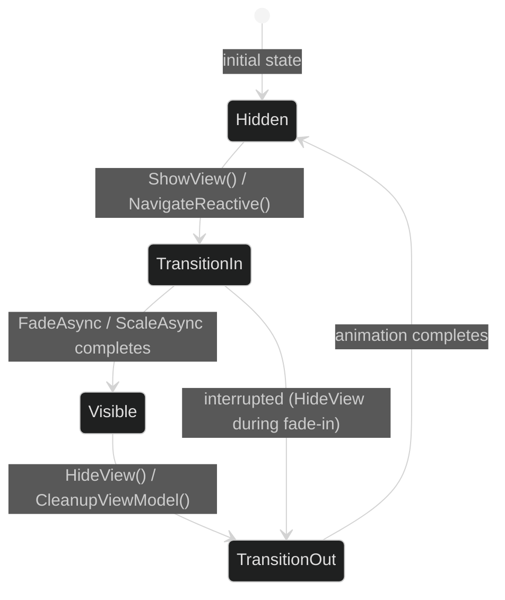

# Maqui — Animation & Transitions

---

## 1. AnimationBridge

`AnimationBridge` is a `MonoBehaviour` singleton (created by `CoreBootstrap`) that provides UniTask-based, cancellation-safe animation utilities.

```csharp
// Maqui.Core.Bridge.AnimationBridge
public class AnimationBridge : MonoBehaviour
{
    public static AnimationBridge Instance { get; private set; }

    public async UniTask FadeAsync(CanvasGroup group, float targetAlpha, float duration,
        CancellationToken ct = default);

    public async UniTask ScaleAsync(RectTransform transform, Vector3 targetScale, float duration,
        AnimationCurve curve = null, CancellationToken ct = default);

    public async UniTask SceneTransitionAsync(string sceneName, float duration, Color color,
        CancellationToken ct = default);
}
```

All methods:
- Are **awaitable** — you get exact completion control.
- Accept a **`CancellationToken`** — use `this.GetCancellationTokenOnDestroy()` to auto-cancel if the `GameObject` is destroyed mid-animation.
- Run on the **Unity player loop** (`PlayerLoopTiming.Update`) — safe for all `transform` and `CanvasGroup` modifications.

---

## 2. View Transition Lifecycle



During `TransitionIn` and `TransitionOut`, `BaseView` (OneUI) sets `CanvasGroup.blocksRaycasts = false` to prevent ghost input. This is automatic — you do not need to manage it.

---

## 3. Common Patterns

### Fade a view in/out

```csharp
private CancellationTokenSource _cts;

public async UniTask ShowWithFadeAsync()
{
    _cts?.Cancel();
    _cts = new CancellationTokenSource();

    canvasGroup.alpha = 0f;
    gameObject.SetActive(true);
    await AnimationBridge.Instance.FadeAsync(canvasGroup, 1f, 0.25f, _cts.Token);
}

public async UniTask HideWithFadeAsync()
{
    _cts?.Cancel();
    _cts = new CancellationTokenSource();

    await AnimationBridge.Instance.FadeAsync(canvasGroup, 0f, 0.25f, _cts.Token);
    gameObject.SetActive(false);
}
```

### Pop-in scale animation

```csharp
private static readonly AnimationCurve OvershootCurve = new AnimationCurve(
    new Keyframe(0f, 0f, 0f, 2.5f),
    new Keyframe(0.7f, 1.1f),
    new Keyframe(1f, 1f)
);

public async UniTask PopInAsync(CancellationToken ct = default)
{
    rectTransform.localScale = Vector3.zero;
    await AnimationBridge.Instance.ScaleAsync(
        rectTransform,
        Vector3.one,
        duration: 0.35f,
        curve: OvershootCurve,
        ct: ct
    );
}
```

### Cinematic screen transition (from GrandTour sample)

```csharp
public async ValueTask InvokeAsync<T>(T command, PublishContext ctx, PublishContinuation<T> next)
    where T : ICommand
{
    if (command is NavigateToDemoCommand)
    {
        // 1. Show loading indicator
        _globalState.IsLoading.Value = true;

        // 2. Wait for async work (data fetch, scene load prep)
        await UniTask.Delay(TimeSpan.FromSeconds(1.5f), cancellationToken: ctx.CancellationToken);

        // 3. Update state — subscribers re-render
        _globalState.IsLoading.Value = false;
        _globalState.ActiveViewCount.Value = navCmd.DemoId;
        return;
    }

    await next(command, ctx);
}
```

---

## 4. Scene Transitions

```csharp
// Fade to black, load scene, then show the new scene
await AnimationBridge.Instance.SceneTransitionAsync(
    sceneName: "GameScene",
    duration: 0.4f,
    color: Color.black,
    ct: this.GetCancellationTokenOnDestroy()
);
```

> **Note**: `SceneTransitionAsync` in the current implementation logs and calls `SceneManager.LoadScene`. For production use, extend this method to spawn a full-screen overlay `Canvas` before the fade, then destroy it after the new scene loads. The API surface is intentionally minimal — override via subclass or composition.

---

## 5. DisplayOptions (OneUI Contract)

`DisplayOptions` is the data structure passed to `UIFramework.Navigate` (OneUI) for view transitions:

```csharp
UIFramework.Navigate(view, new DisplayOptions
{
    IsAnimated = true,
    Duration = 0.3f,
    Type = AnimationType.Fade,           // Fade | Scale
    OnComplete = (isVisible) => { }      // fires after transition finishes
});

// Shortcut — no animation
view.ShowView(new DisplayOptions { IsAnimated = false });
```

`MaquiNavigator.NavigateReactive` calls `UIFramework.Navigate(view)` with default options. If you need custom transition parameters, use the manual injection pattern (Step 5B from Quick Start) and call `ShowView()` directly.

---

## 6. Timing Standards

| Transition type | Duration | Curve |
|:---|:---:|:---|
| Full-screen fade | 200–300ms | Linear or ease-out |
| Modal / dialog pop | 250–350ms | Overshoot (spring) |
| Toast / snackbar | 150–200ms | Ease-in |
| Tooltip | 100–150ms | Linear |
| Scene transition (fade-to-black) | 350–500ms | Ease-in-out |
| List item stagger | 50ms per item, max 8 items | Ease-out |

Keeping transitions **under 350ms** maintains the perception of responsiveness. Anything beyond 500ms will feel sluggish on mobile hardware.

---

## 7. CancellationToken Discipline

Always pass a `CancellationToken` that is tied to the lifetime of the calling object:

```csharp
// In a MonoBehaviour:
private async UniTask DoTransitionAsync()
{
    var ct = this.GetCancellationTokenOnDestroy(); // from UniTask
    await AnimationBridge.Instance.FadeAsync(canvasGroup, 1f, 0.3f, ct);
    // If the GameObject is destroyed before the fade completes,
    // the UniTask is cancelled cleanly — no exception, no MissingReferenceException.
}
```

For interceptors, use `ctx.CancellationToken`:
```csharp
public async ValueTask InvokeAsync<T>(T cmd, PublishContext ctx, PublishContinuation<T> next)
    where T : ICommand
{
    await AnimationBridge.Instance.FadeAsync(overlay, 0f, 0.25f, ctx.CancellationToken);
    await next(cmd, ctx);
}
```
