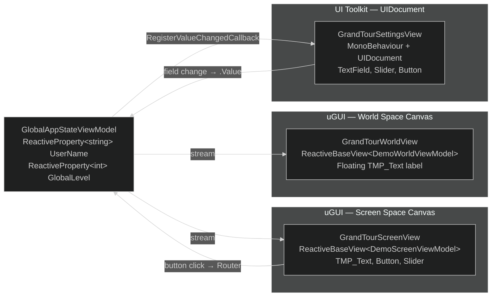

# Maqui — Hybrid Rendering (uGUI + UI Toolkit)

---

## 1. Decision Matrix

Maqui is rendering-agnostic at the ViewModel level. The decision between uGUI and UI Toolkit is made at the View layer based on performance and authoring needs.

```mermaid
---
config:
  theme: dark
---
graph TD
    Q1{Does this view need<br/>visual FX?<br/>blur, shadow, particles}
    Q2{Is this view<br/>data-dense or list-based?<br/>100+ items}
    Q3{Does it need<br/>pixel-perfect positioning<br/>or custom shaders?}
    Q4{Is this a<br/>developer tool or<br/>settings panel?}

    Q1 -->|Yes| UG[uGUI + Le Tai FX<br/>ReactiveBaseView&lt;T&gt;]
    Q1 -->|No| Q2
    Q2 -->|Yes| UITk[UI Toolkit<br/>UIDocument + VisualElement]
    Q2 -->|No| Q3
    Q3 -->|Yes| UG
    Q3 -->|No| Q4
    Q4 -->|Yes| UITk
    Q4 -->|No| UG

    style UG fill:#1a3a4a,stroke:#3fb9b4
    style UITk fill:#2a3a1a,stroke:#7bc47f
```



| Use uGUI | Use UI Toolkit |
|:---|:---|
| Glassmorphism, blur (TranslucentImage) | Large virtualized lists (inventory, leaderboards) |
| Drop shadows (TrueShadow) | Dynamic form layouts |
| Particle effects (Coffee.UIParticle) | Settings / developer tool panels |
| Animated icons, sprite-based art | Frequently resized / responsive layouts |
| Pre-built OneUI prefab components | UXML/USS design system integration |

---

## 2. Hybrid Architecture: One ViewModel, Two Views

The `GrandTourSettingsView` sample demonstrates three different rendering paradigms driven by a **single** `GlobalAppStateViewModel`:



Key insight: The uGUI views use R3 `.Subscribe()`. The UI Toolkit view uses `RegisterValueChangedCallback`. Both patterns update the **same** `ReactiveProperty` on the ViewModel — the integration point is the ViewModel, not the rendering system.

---

## 3. ReactiveBaseView for uGUI

Standard pattern — detailed in [Core Concepts](03-core-concepts.md).

```csharp
public class ProfileView : ReactiveBaseView<ProfileViewModel>
{
    [SerializeField] private TMP_Text nameLabel;

    protected override void OnBind()
    {
        ViewModel.DisplayName
            .Subscribe(n => nameLabel.text = n)
            .AddTo(Disposables);
    }
}
```

---

## 4. UI Toolkit Integration Pattern

UI Toolkit views in Maqui are **plain `MonoBehaviour`s** that hold a `UIDocument` reference. They do not inherit from `ReactiveBaseView` — they receive a ViewModel and bind manually.

```csharp
public class LeaderboardPanel : MonoBehaviour
{
    [SerializeField] private UIDocument document;

    private LeaderboardViewModel _vm;
    private MultiColumnListView _listView;
    private readonly CompositeDisposable _d = new();

    public void Initialize(LeaderboardViewModel vm)
    {
        _vm = vm;
        var root = document.rootVisualElement;

        _listView = root.Q<MultiColumnListView>("leaderboard-list");
        ConfigureColumns();

        // Bind ViewModel stream → UI Toolkit
        _vm.Entries
            .Subscribe(entries =>
            {
                _listView.itemsSource = entries;
                _listView.Rebuild();
            })
            .AddTo(_d);

        // Bind UI Toolkit event → ViewModel
        _listView.selectionChanged += objects =>
        {
            if (_listView.selectedItem is LeaderboardEntry entry)
                _vm.Select(entry);
        };
    }

    private void ConfigureColumns()
    {
        _listView.columns["rank"].makeCell = () => new Label { name = "rank-cell" };
        _listView.columns["rank"].bindCell = (element, index) =>
        {
            var label = element as Label;
            label!.text = (_vm.Entries.CurrentValue[index].Rank).ToString();
        };
        // Additional columns...
    }

    private void OnDestroy() => _d.Dispose();
}
```

### Performance: Shared PanelSettings

All `UIDocument` components in a scene should reference **the same `PanelSettings` asset**. Using separate `PanelSettings` per document increases draw calls and memory.

Create one `PanelSettings` asset → assign it to every `UIDocument` in the project.

---

## 5. Input Focus Across Systems

When both uGUI and UI Toolkit are active, input focus must be managed explicitly:

```csharp
// Prevent uGUI EventSystem from intercepting clicks on UI Toolkit panels
// Add this to any UI Toolkit panel that needs exclusive input
var root = document.rootVisualElement;
root.pickingMode = PickingMode.Position; // captures pointer events
root.focusable = true;
root.Focus();
```

For the reverse — preventing UI Toolkit from consuming clicks meant for uGUI:
```csharp
root.pickingMode = PickingMode.Ignore; // transparent to pointer events
```

---

## 6. Rendering Layer Stacking

When combining uGUI and UI Toolkit in a single scene, set render order explicitly:

| Layer | Rendering System | Sort Order / Panel Sort Order |
|:---|:---|:---|
| Background / World | uGUI (World Space Canvas) | 0 |
| Game HUD | uGUI (Screen Space Overlay) | 100 |
| Data Panels | UI Toolkit (UIDocument) | PanelSettings Sort Order: 150 |
| Popups / Modals | uGUI (Screen Space Overlay) | 200 |
| Global Overlays | uGUI (Screen Space Overlay) | 300 |

In URP, UI Toolkit renders via a dedicated `UIDocument` renderer feature. Ensure your URP `UniversalRendererData` asset has the UI renderer configured for the correct camera and sort order.

---

## 7. When to Not Mix

Avoid mixing systems within a single logical "view" (e.g., a profile card that is half uGUI, half UI Toolkit). The integration points create complexity and make transitions difficult. The canonical rule:

> **A single screen is either uGUI or UI Toolkit. The two systems can coexist in the same scene but should not be interleaved within the same component.**

Cross-system communication always flows through the ViewModel or VitalRouter — never through direct references between uGUI components and `VisualElement` objects.
