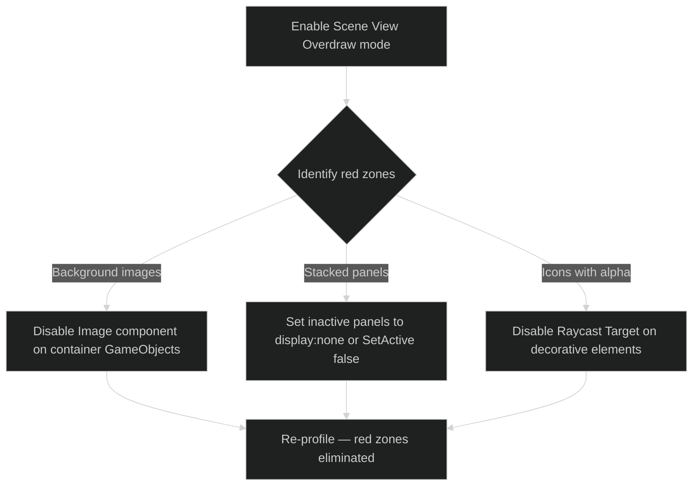

# Maqui — Performance Guide

> Target: URP 17.x on mobile (60fps) and desktop (120fps). All figures assume a mid-range Android device (Snapdragon 8 Gen 1 class).

---

## 1. Performance Budget

| Resource | Target | Hard Limit |
|:---|:---:|:---:|
| UI CPU per frame | < 2ms | 4ms |
| UI draw calls per scene | < 20 | 35 |
| Canvas rebuilds per second | < 5 | 15 |
| Material instances (`(Instance)` in memory) | 0 | 3 |
| `FindObjectOfType` calls at runtime | 0 | 0 |

---

## 2. Canvas Rebuild Control

The single highest-impact optimization in uGUI. A canvas rebuild recalculates all mesh geometry on the CPU.

### What triggers a canvas rebuild
- Any `RectTransform` position/size change on a dirty graphic.
- Enabling or disabling a `GameObject` that contains a `Graphic` component.
- Changing `text`, `color`, `sprite`, or `material` on a `Graphic`.

### Sub-Canvas isolation (mandatory for animated elements)

Any element that updates every frame (progress bars, loading spinners, animated icons) **must** be on its own child `Canvas` component:

```
Root Canvas
├── Static UI                  (no child Canvas — batches together)
│   ├── Header
│   └── Footer
└── Dynamic Elements Canvas    ← child Canvas, isolates rebuilds
    ├── ProgressBar
    ├── LoadingSpinner
    └── LiveCounter
```

```csharp
// Verify this with the Unity UI Profiler (Window → Analysis → UI Profiler)
// Look for "Canvas.BuildBatch" — each call there is a rebuild.
```

### Maqui impact: R3 subscriptions fire per-value, not per-frame

Because R3 is push-based, a `ReactiveProperty<float>` subscriber fires **only when the value changes**, not every frame. A progress bar driven by a ViewModel does not continuously dirty the canvas when the progress hasn't changed.

```csharp
// This fires only when LoadingProgress changes value, not every frame
ViewModel.LoadingProgress
    .Subscribe(p => progressSlider.value = p)
    .AddTo(Disposables);
// vs. a coroutine or Update() loop that writes every frame even if value is the same
```

---

## 3. Draw Call Reduction

### Sprite Atlas (mandatory for icon-heavy UIs)

All UI icons must be packed into a `Sprite Atlas`. Separate sprites break batching.

```
Assets/
  UI/
    Atlases/
      Icons_Core.spriteatlas       ← all system icons
      Icons_Items.spriteatlas      ← item/inventory icons
      Icons_Status.spriteatlas     ← status effects
```

Rule: Any UI that displays more than 3 distinct sprites must use an atlas. Check with the Frame Debugger (Window → Analysis → Frame Debugger) — identical draw call steps back-to-back indicate batching success.

### Material instance prevention

Le Tai's `TranslucentImage` and `TrueShadow` create material instances if used carelessly. Use the **Shared Material** workflow:

```csharp
// ❌ Creates a new material instance — breaks batching
GetComponent<Image>().material.SetFloat("_BlurSize", 20f);

// ✅ Modify the shared material (affects all users of this material — intended)
blurMaterial.SetFloat("_BlurSize", 20f);
// OR use the component's built-in property
translucentImage.Size = 20f; // TranslucentImage exposes this as a property
```

Check the Memory Profiler (Window → Analysis → Memory Profiler) for objects named `Material (Instance)` — these are leaked material instances.

### Overdraw reduction



Target: no "hot red" zones in the Scene View overdraw visualization. Each additional transparent layer costs fill rate linearly.

---

## 4. Raycast Optimization

uGUI's `GraphicRaycaster` tests every `Graphic` with `Raycast Target = true` on every pointer event. On complex UIs, this is a significant CPU cost.

**Disable `Raycast Target` on**:
- Text labels (unless they are links)
- Background images and decorative graphics
- Icons
- Any `Image` used only for visual effect

**Enable `Raycast Target` only on**:
- `Button` root objects
- `Slider` tracks
- `InputField` backgrounds
- `ScrollRect` viewport

Automate this with a batch editor script:

```csharp
#if UNITY_EDITOR
[MenuItem("Maqui/Tools/Disable Raycast on Non-Interactive Graphics")]
static void DisableNonInteractiveRaycasts()
{
    foreach (var graphic in Selection.activeGameObject.GetComponentsInChildren<Graphic>(true))
    {
        if (graphic.GetComponent<Selectable>() == null && !(graphic is TMPro.TMP_InputField))
            graphic.raycastTarget = false;
    }
}
#endif
```

---

## 5. RectMask2D vs Mask

| | `Mask` (Stencil) | `RectMask2D` |
|:---|:---:|:---:|
| Draw calls impact | **+2** (stencil write/test) | 0 |
| CPU overhead | High | Low |
| Supports rounded corners | Yes (with shader) | No |
| Supports arbitrary shapes | Yes | No (rectangle only) |
| Use for scroll views | ❌ | ✅ |
| Use for complex clip shapes | ✅ | ❌ |

For all `ScrollRect` and panel-clip scenarios: use `RectMask2D`. Only use `Mask` when you require non-rectangular clipping.

---

## 6. Static UI Optimization

For UI elements that never change at runtime (achievement icons, background panels, static banners):

1. Disable the `Canvas` component while the view is hidden. This removes the GameObject from the canvas rebuild queue entirely.
2. Use `GraphicRaycaster.enabled = false` on canvases while they are not the active focus.

```csharp
// In HideView override:
public override void OnViewDestroy()
{
    base.OnViewDestroy();
    // Disable canvas to fully remove from rebuild pipeline
    if (TryGetComponent<Canvas>(out var canvas))
        canvas.enabled = false;
}
```

---

## 7. Memory: Subscription Leak Detection

Common leak pattern in reactive UIs: forgetting to `.AddTo(Disposables)`.

Use this editor utility to detect unpaired subscriptions at shutdown:

```csharp
#if UNITY_EDITOR || DEVELOPMENT_BUILD
public abstract class ReactiveBaseView<T> : BaseView where T : ViewModel
{
    protected override void OnBind()
    {
        int countBefore = Disposables.Count;
        OnBindInternal();
        int countAfter = Disposables.Count;
        // If you created N subscriptions but count didn't increase N times, you have a leak.
        Debug.Log($"[Maqui] {GetType().Name} bound {countAfter - countBefore} subscriptions.");
    }

    protected abstract void OnBindInternal();
}
#endif
```

---

## 8. Profiling Checklist

Before shipping a screen:

- [ ] **UI Profiler**: `Canvas.BuildBatch` < 5ms per frame when UI is idle.
- [ ] **Frame Debugger**: Draw calls within budget. No unexpected breaks in the batch.
- [ ] **Memory Profiler**: Zero `Material (Instance)` objects in the UI layer.
- [ ] **Overdraw**: No "hot red" zones in Scene View overdraw mode.
- [ ] **Subscriptions**: Every `.Subscribe()` call has `.AddTo(...)`.
- [ ] **Interceptors**: All registered interceptors have a corresponding `UnfilterAsync` call.
- [ ] **Raycast Targets**: Only interactive elements have `Raycast Target = true`.
- [ ] **Texture format**: All UI sprites are `RGBA Compressed ASTC 6x6` on Android / `RGBA Compressed BC7` on desktop.

---

## 9. URP 17.x Specific Notes

- **UI Document rendering order**: Set `PanelSettings.sortingOrder` correctly relative to your screen-space Canvas sort orders. URP composites UI Toolkit separately from uGUI.
- **HDR / Bloom on UI**: If you use URP's Bloom post-processing, `Canvas → Render Mode: Screen Space - Camera` will pick it up. For `Screen Space - Overlay`, bloom does not affect the UI canvas. Choose based on whether you want UI to glow.
- **RenderTexture UI**: For minimap or in-world screen UIs, use `World Space Canvas` with a dedicated camera and `RenderTexture` target, not the main camera.
