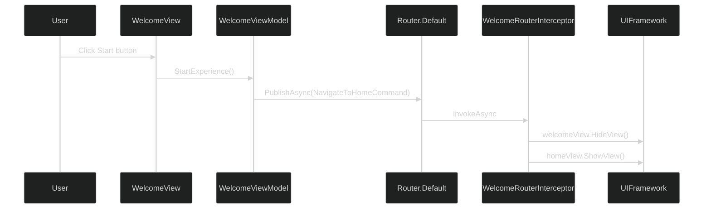
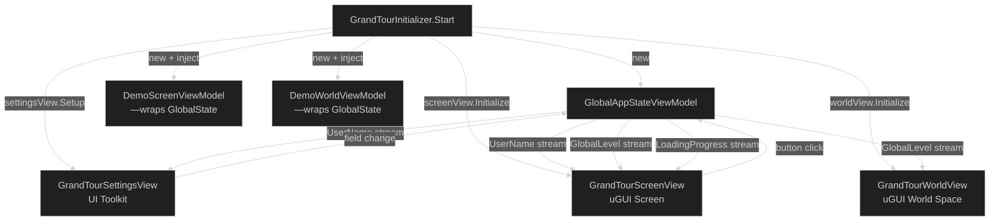
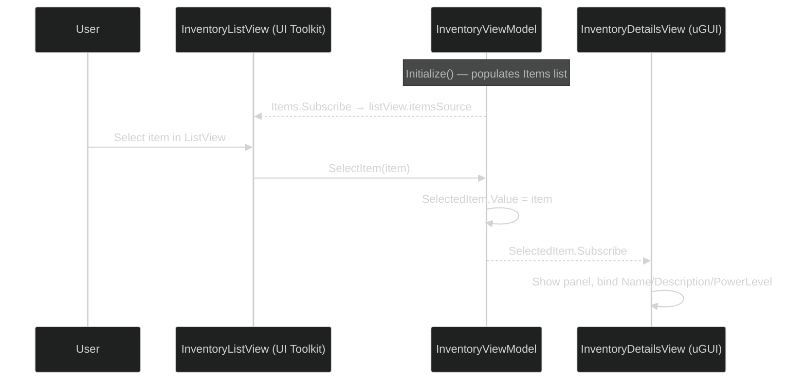

# Maqui — Samples Reference

All samples live in `Packages/com.ware.maqui/Samples~/`. Import via **Package Manager → Maqui → Samples → [Sample Name] → Import**.

Each sample has its own Assembly Definition (`autoReferenced: false`) and does not compile until imported.

---

## Sample 1: Welcome

**Path**: `Samples~/Welcome/`
**Assembly**: `Maqui.Samples.Welcome`

### What it demonstrates
- Minimum viable Maqui screen: one ViewModel, one View, one VitalRouter command.
- `WelcomeRouterInterceptor` — how to intercept a specific command and delegate to OneUI's navigation.
- `WelcomeViewModel.StartExperience()` → `Router.Default.PublishAsync(new NavigateToHomeCommand())`.

### Key files

| File | Role |
|:---|:---|
| `NavigateToHomeCommand.cs` | Zero-data signal command — marks intent, no payload |
| `WelcomeViewModel.cs` | `ReactiveProperty<string>` title + description; `StartExperience()` publishes command |
| `WelcomeView.cs` | Binds TMP labels + `Button.onClick.AsObservable()` |
| `WelcomeRouterInterceptor.cs` | Intercepts `NavigateToHomeCommand`, drives OneUI show/hide |

### Architecture



### Integration notes
- `WelcomeRouterInterceptor` must be registered before the scene loads. In the sample, it's registered inside the scene's initializer (not in `CoreBootstrap`).
- `WelcomeViewModel` uses `Router.Default.PublishAsync` — requires `RouterBridge` to be initialized (guaranteed by `CoreBootstrap`).

---

## Sample 2: Grand Tour

**Path**: `Samples~/GrandTour/`
**Assembly**: `Maqui.Samples.GrandTour`

### What it demonstrates
- **Shared state across multiple view types**: one `GlobalAppStateViewModel` drives three simultaneous views.
- **Cross-paradigm binding**: uGUI Screen View, uGUI World Space View, and UI Toolkit Settings View all bound to the same ViewModel.
- **Async interceptor**: `GrandTourInterceptor` uses `await UniTask.Delay` to simulate cinematic transitions.
- **Manual injection**: `GrandTourInitializer` creates ViewModels and calls `view.Initialize(...)` directly (no `MaquiNavigator`).

### Key files

| File | Role |
|:---|:---|
| `GrandTourViewModels.cs` | `GlobalAppStateViewModel` (shared), `DemoScreenViewModel`, `DemoWorldViewModel` |
| `GrandTourViews.cs` | `GrandTourScreenView` (uGUI), `GrandTourWorldView` (uGUI World Space) |
| `GrandTourSettingsView.cs` | UI Toolkit view — uses `RegisterValueChangedCallback`, not `.Subscribe()` |
| `GrandTourInterceptor.cs` | `NavigateToDemoCommand` handler with async loading simulation |
| `GrandTourInitializer.cs` | MonoBehaviour — creates shared VM, registers interceptor, calls Initialize() |

### State flow



### Integration notes
- `GrandTourSettingsView` is **not** a `ReactiveBaseView`. It's a plain `MonoBehaviour` that binds UI Toolkit events to ViewModel properties. This is the canonical pattern for UI Toolkit integration.
- `GlobalAppStateViewModel.SimulateLoading()` uses `async void` — acceptable in ViewModels that fire-and-forget internal animations. For production, use `async UniTask` + `CancellationToken`.

---

## Sample 3: Shark Suite

**Path**: `Samples~/SharkSuite/`
**Assembly**: `Maqui.Samples.SharkSuite`

### What it demonstrates
- **Hybrid inventory**: UI Toolkit `ListView` for the item list, uGUI `ReactiveBaseView` for the detail panel.
- **Reactive selection**: `InventoryViewModel.SelectedItem` (`ReactiveProperty<InventoryItem>`) drives both the detail panel visibility and content.
- **Bidirectional binding**: UI Toolkit `onSelectionChange` → ViewModel; ViewModel R3 stream → uGUI detail panel.

### Key files

| File | Role |
|:---|:---|
| `Logic/InventoryViewModel.cs` | `Items` list + `SelectedItem` reactive; `Initialize()` populates mock data |
| `UI/InventoryListView.cs` | UI Toolkit — binds `ListView.itemsSource`, handles `onSelectionChange` |
| `UI/InventoryDetailsView.cs` | uGUI `ReactiveBaseView<InventoryViewModel>` — shows/hides based on `SelectedItem` |
| `SharkSuiteInitializer.cs` | Creates ViewModel, calls Initialize(), hands refs to both Views |

### Data flow



### Integration notes
- `InventoryDetailsView` uses `.Where(item => item != null)` to filter the initial `null` emission. Without this filter, `OnBind` would run once with a null SelectedItem and throw.
- `InventoryListView` does **not** inherit from `ReactiveBaseView` — it's a plain `MonoBehaviour` with a `UIDocument` reference, following the [hybrid rendering pattern](07-hybrid-rendering.md).

---

## Sample 4: Modernization

**Path**: `Samples~/Modernization/`
**Assembly**: `Maqui.Samples.Modernization`

### What it demonstrates
- **Procedural "zero-texture" UI**: using `Ricimi.Gradient` (from the Modular Game UI Kit) driven by ViewModel reactive properties.
- **Theme-driven procedural visuals**: `ModernizationViewModel.SelectedColorType` controls gradient colors and icon theming simultaneously.
- **Hybrid ThemeSubscriber + ReactiveBaseView**: `ModernizationView` is a `ReactiveBaseView` that also uses `ThemeImageSubscriber` on child components.

### Key files

| File | Role |
|:---|:---|
| `ModernizationViewModel.cs` | `IsHighPerformance`, `BlurIntensity`, `SelectedColorType` reactive state |
| `ModernizationView.cs` | Binds gradient + icon color to `SelectedColorType` stream |

### Integration notes
- `ModernizationView` depends on `Ricimi.Gradient`, which is a Modular Game UI Kit component. This is a **sandbox dependency**, not a `com.ware.maqui` dependency. If you import this sample into a project without the Modular Kit, you'll need to substitute your own gradient component.
- `BackgroundGradient.SendMessage("OnThemeChanged", ...)` is a workaround for the Ricimi component's non-reactive API. In production, replace this with a proper interface or direct property setting.
- This sample is the reference for the "before/after legacy migration" use case — it shows a OneUI screen that has been upgraded to the Maqui MVVM pattern without replacing any visual assets.

---

## Running Sample Tests

Maqui package tests are in `Tests/Runtime/` and `Tests/Editor/`. To run them from the CharqUI sandbox:

1. Ensure `com.ware.maqui` is in `Packages/manifest.json`'s `"testables"` array (already configured in CharqUI).
2. Open **Window → General → Test Runner**.
3. Switch to **EditMode** or **PlayMode** tab.
4. Filter by `Maqui.Tests` — both `ViewModelTests` and `ThemeDataTests` will appear.
5. Click **Run All**.

```json
// CharqUI/Packages/manifest.json (already configured)
"testables": ["com.ware.maqui"]
```
