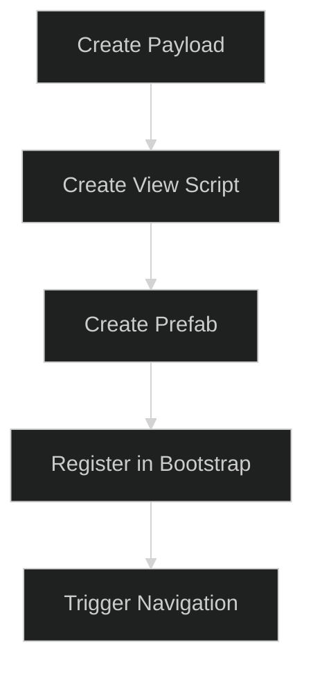

# Developer Onboarding Playbook

This playbook is designed to get a new developer from "Zero to Hero" in the **OneUI** system. It provides a standardized workflow for adding a new UI screen.

---

## 1. Quick-Start Checklist

Total implementation time for a simple screen should be **under 20 minutes**.



### Step 1: Define the Contract (Payload)
Create a new file in `Assets/UI/OneUI/Scripts/Payloads`.
```csharp
public class ProfileUpdatePayload : IPayload {
    public string Username;
}
```

### Step 2: Create the View Logic
Inherit from `BaseView` and subscribe to your events.
```csharp
public class ProfileView : BaseView {
    public override void OnViewStart() {
        EventMessenger.Main.Subscribe<ProfileUpdatePayload>(UpdateProfile);
    }
    private void UpdateProfile(ProfileUpdatePayload payload) {
        // Update UI Text
    }
}
```

### Step 3: Scene Setup
1. Create a Prefab from your UI.
2. Add your `ProfileView` component to the root.
3. Add the prefab to the `ObjectInstaller` in your Scene.

---

## 2. Key DX Concepts

- **Decoupling**: Never call `FindObjectOfType<MyView>()`. Use the `UIFramework.GetView<T>()` or trigger it via a payload.
- **Payload-First Design**: Always ask "What data is changing?" before writing UI code.
- **Composition over Inheritance**: Use smaller modular components (from the Modular Kit) inside your `BaseView` rather than creating massive View scripts.

---

## 3. Debugging Your UI

1. **State Catch-up**: If a view is empty on load, check if you are using `EventMessenger.Main.GetState<T>()` to fetch the last known data.
2. **Raycast Blocking**: If buttons aren't clickable, check the `CanvasGroup` on the `BaseView` or ensure no invisible "Raycast Target" images are overlapping.
3. **Missing Binding**: Ensure `SceneController.BindViews()` includes your new View type.

---

## 4. Final Verification

Before submitting a PR, ensure:
- [ ] View follows the `BaseView` pattern.
- [ ] No direct references to game logic (use Payloads).
- [ ] Transitions work correctly with `DisplayOptions`.
- [ ] UI looks premium with procedural gradients.

> [!TIP]
> Use the **Demo Scene** in `Assets/UI/OneUI/Demo` to test your new View in isolation before integrating it into the main project.

---

## Related Documents
- [UI System Bootstrap Flow](UI-System-Bootstrap-Flow.md)
- [Payload Contract Library](Payload-Contract-Library.md)
