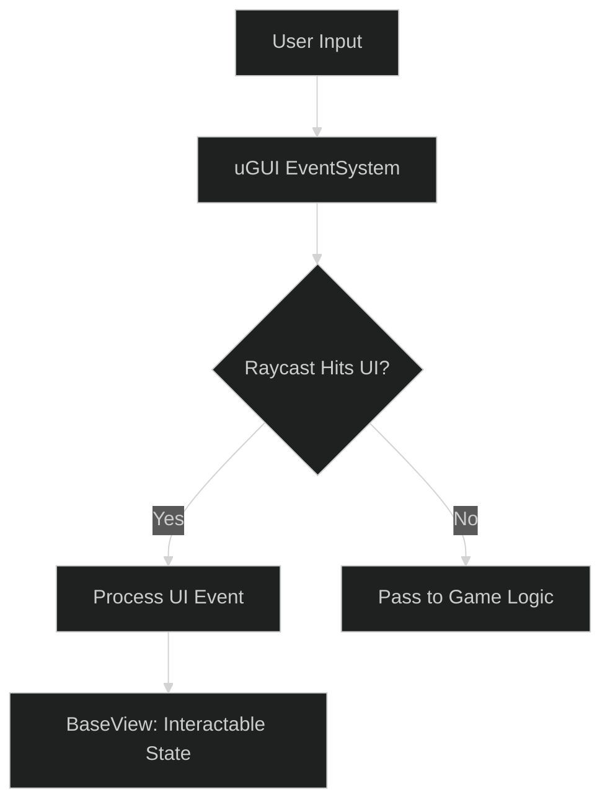

# Input Management Layer

The **OneUI** framework manages user interaction through a combination of standard uGUI raycasting and state-based input blocking. This layer ensures that UI interactions do not conflict with background game logic.

---

## 1. Input Blocking Mechanics

To prevent "Click-Through" (where clicking a UI button also triggers a game action), the system uses the `CanvasGroup` components managed by `BaseView`.



### Automatic Blocking Policies:
- **During Transitions**: `blocksRaycasts` is set to `false` in `BaseView.AnimateView` to prevent users from clicking buttons while a screen is fading in or out.
- **Modal Popups**: The `Popup` script procedurally generates a background image that covers the entire screen, effectively capturing all raycasts and forcing focus on the modal.
- **Global Blocking**: Use the `UIFramework.GetWrapper()` to disable the `EventSystem` entirely during critical scene loads.

---

## 2. Integration with New Input System

For advanced DX, it is recommended to bridge the **Unity Input System** with the framework using the `InputSystem_Actions` asset.

### Recommended Pattern:
```csharp
public class MyInteractiveView : BaseView {
    // Standard binding to New Input System
    public void OnNavigateInput(InputAction.CallbackContext context) {
        if (!IsVisible()) return;
        // Logic for controller/keyboard navigation
    }
}
```

> [!TIP]
> To support **both** Legacy and New Input System simultaneously, see the [Dual-Input System Abstraction](design/dual-input-system-abstraction.md).

---

## 3. Input Hierarchy & Focus

The **Navigation History** in `UIFramework` dictates which view is "Active."
- **Current View**: Has `blocksRaycasts = true` and `interactable = true`.
- **Background Views**: Have `interactable = false` to prevent accidental clicks on partially visible elements.
- **Stack-Based Focus**: When a popup is shown, the previously active view should have its input disabled via a `CanvasGroup` override.

---

## 4. Best Practices

1. **Explicit Raycast Targets**: Only enable `Raycast Target` on elements that actually need interactions (Buttons, Sliders). Disable it on Text and Icons to reduce graphic raycast overhead.
2. **Global Input Blockers**: Implement a "Blind" view (a full-screen invisible image) that can be toggled via `UIFramework` for blocking all input during network requests.
3. **Controller Support**: Ensure all interactive elements are reachable via navigation arrows by correctly setting up the `Navigation` property in the Inspector.

> [!IMPORTANT]
> Always verify that your `EventSystem` is present in the scene. Without it, none of the OneUI or Modular Kit interactions will function.
