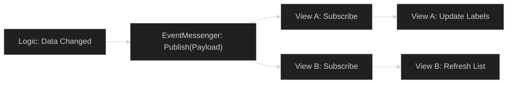

# Payload Contract Library

This document serves as the central API registry for the **OneUI** messaging system. It defines the "Contracts" that decoupled components use to communicate via the `EventMessenger`.

---

## 1. System State Payloads
Defined in [BasePayloads.cs](file:///d:/ware/CharqUI/Assets/UI/OneUI/Shared/UIFramework/Payloads/BasePayloads.cs). These drive the framework's internal core logic.

| Payload Name          | Fields                                                  | Description                                 |
| :-------------------- | :------------------------------------------------------ | :------------------------------------------ |
| `OnViewAdded`         | `IBaseView View`                                        | Triggered when a new view is registered.    |
| `OnViewShown`         | `IBaseView View`                                        | Triggered when a view transition COMPLETES. |
| `OnViewHidden`        | `IBaseView View`                                        | Triggered when a view is fully removed.     |
| `OnViewUpdated`       | `Type View`, `IViewData Data`                           | Used for partial view data refreshes.       |
| `OnViewNavigated`     | `Type View`, `IViewData Data`, `DisplayOptions Display` | Triggers a global navigation event.         |
| `OnViewBackRequested` | `Type View`, `DisplayOptions Display`                   | Triggers the navigation back stack.         |

---

## 2. Standard Dialogue & Interaction Payloads
Defined in `Assets/UI/OneUI/Scripts/Payloads`. These are used for standard UI patterns (Popups, Search, Prompts).

### ConfirmDialoguePayload
Used for "Yes/No" or "Confirm/Cancel" scenarios.
- `string Title`
- `string Description`
- `Action OnConfirm`
- `bool ShowCancelButton`
- `bool ShowCloseButton`

### PromptPayload
Used for text input collection.
- `string Title`
- `string DefaultValue`
- `Action<string> OnSubmit`

### SearchPayload
Encapsulates search request logic.
- `Action<string> OnRequestFormed`
- `string PlaceholderText`

---

## 3. Communication Workflow

The interaction pattern should always follow the **Publish-Subscribe** model to maintain high DX and separation of concerns.

### Best Practices:
1. **Never pass UI Components**: Only pass data (strings, ints, simple POCOs) in payloads.
2. **Immutable Payloads**: Avoid changing payload data mid-transit.
3. **Dedicated Payloads**: Create a new payload type for fundamentally different actions rather than reusing generic objects.

> [!TIP]
> Use `EventMessenger.Main.GetState<T>()` if a component initializes late and needs the "last known" data state for a specific contract.

---

## Related Documents
- [UI System Bootstrap Flow](UI-System-Bootstrap-Flow.md)
- [Developer Onboarding Playbook](Developer-Onboarding-Playbook.md)
