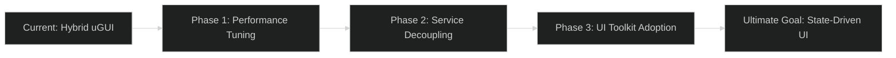

# System Upgrade Roadmap

This document outlines the long-term technical evolution of the **OneUI** system. It focuses on resolving technical debt, improving performance, and adopting modern Unity technologies.

---

## 1. Evolution Timeline

### Phase 1: Performance Tuning (Q1)
- **Goal**: Achieve < 2ms UI CPU frame time.
- **Action**: Migrate procedural C# lerps to Shader-based transparency and scale.
- **Action**: Implement a "Static Canvas" system that disables updating when the UI is idle.

### Phase 2: Service Decoupling (Q2)
- **Goal**: Improve unit testability (High DX).
- **Action**: Wrap `UIFramework` in an interface (`IUIFramework`) and use Dependency Injection (e.g., Zenject/VContainer).
- **Action**: Move from `FindObjectOfType` registration to manual Installer-based registration.

### Phase 3: UI Toolkit Adoption (Q3)
- **Goal**: Modernize the rendering engine.
- **Action**: Implement the `UIToolkitBaseView`.
- **Action**: Transition high-density screens (Inventory, Leaderboards) to UXML/USS.

---

## 2. Technical Debt Backlog

| Item                   | Priority | Impact                |
| :--------------------- | :------- | :-------------------- |
| **Material Instances** | High     | GPU Memory & Batching |
| **Static Framework**   | Medium   | Testing & Mocking     |
| **Resources Loading**  | Low      | Disk I/O & Load Times |

---

## 3. High-Priority Features

1. **Integrated Profiler Overlay**: A debug view that shows draw calls and canvas rebuilds in real-time.
2. **Visual Editor for Theme**: A tool to change `Gradient.cs` colors and `DisplayOptions` values globally across all prefabs.
3. **Responsive Layout Engine**: Automatic adjustment of UI elements based on aspect ratio (e.g., Ultra-Wide vs. Mobile).

---

## 4. Vision for the "Ultimate DX"

The end goal is a UI system where **Logic** and **Presentation** are so decoupled that you can swap the entire rendering engine (from uGUI to UI Toolkit) without changing a single line of game logic.

> [!IMPORTANT]
> This roadmap serves as a living document. Every new feature implementation should be evaluated against its alignment with the **Phase 3** goal.
