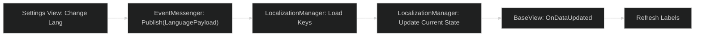

# UI Localization Workflow

To achieve high-quality DX, the **OneUI** system must decouple display strings from the C# view logic and the Unity Inspector. This document outlines the standard workflow for integrating localization into the framework.

---

## 1. Integrated Localization Pattern

The system leverages the `EventMessenger` to trigger language changes globally, ensuring that every active view refreshes its text without a scene reload.



### The `LanguagePayload` Contract:
```csharp
public class LanguagePayload : IPayload {
    public string LanguageCode; // e.g., "en-US", "es-ES"
}
```

---

## 2. Implementing the "Bridged" Label

Every `TextMeshProUGUI` component that needs localization should use a bridge script that listens for framework updates.

```csharp
public class LocalizedLabel : MonoBehaviour {
    [SerializeField] private string LocalizationKey;
    
    void Start() {
        // Initial translation
        UpdateText();
        // Subscribe to global language changes
        EventMessenger.Main.Subscribe<LanguagePayload>(OnLanguageChanged);
    }
    
    private void OnLanguageChanged(LanguagePayload payload) {
        UpdateText();
    }
    
    private void UpdateText() {
        var tmp = GetComponent<TextMeshProUGUI>();
        tmp.text = LocalizationProvider.Get(LocalizationKey);
    }
}
```

---

## 3. Workflow for Developers

1. **Key Assignment**: Identify every string in the UI and assign a unique key (e.g., `HOME_TITLE_WELCOME`).
2. **Data Entry**: Add the key and its translations to your preferred backend (Unity Localization Package or custom CSV/JSON).
3. **View Implementation**:
   - In `BaseView.OnViewStart()`, ensure all dynamic labels are initialized using the `LocalizationProvider`.
   - Use the `LocalizedLabel` component for static UI text.

---

## 4. Best Practices

- **Avoid String Concatenation**: Use `string.Format` or the Localization system's internal variable injection (e.g., `WELCOME_USER`, `"{0} is coming!"`).
- **Layout Flexibility**: Use **Auto-Size** in TextMeshPro or **Content Size Fitters** to accommodate languages with longer word lengths (e.g., German vs. English).
- **Font Switching**: Publish a `FontUpdatePayload` along with the language change if switching to character-heavy languages like Chinese or Arabic.

> [!TIP]
> Integrate the `LocalizationProvider` directly into your `BaseView`. This allows you to call `GetLocalizedString("KEY")` from any view without extra boilerplate.
