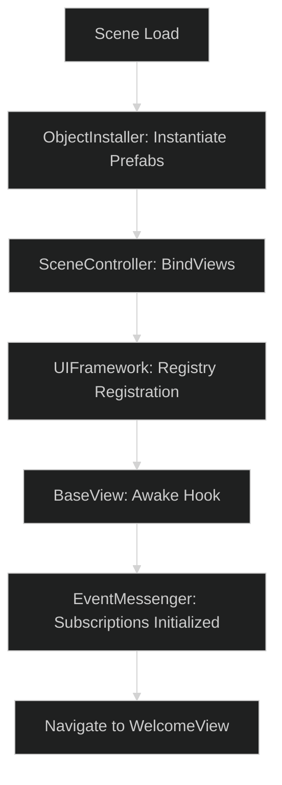

# UI System Bootstrap Flow

The bootstrap sequence is critical for ensuring the **OneUI** architecture is correctly initialized before any view logic executes. It follows a multi-stage approach using scene-based controllers and static registries.

---

## 1. Initialization Sequence

The sequence is divided into three primary phases: **Object Preparation**, **View Binding**, and **Global State Registration**.



### Phase 1: Object Preparation (`ObjectInstaller`)
The `ObjectInstaller` is responsible for physically creating the UI hierarchy in the scene. 

- It iterates through a pre-configured list of prefabs.
- It places them under a dedicated `root` Transform to keep the Hierarchy clean.
- This ensures that when logic begins, all `RectTransform` and `Canvas` references are valid.

### Phase 2: View Binding (`SceneController`)
Once objects exist, the [SceneController](file:///d:/ware/CharqUI/Assets/UI/OneUI/Demo/Scripts/SceneController.cs) connects them to the static `UIFramework` logic.

```csharp
private void BindViews() {
    // Finds instantiated Views and registers them in the global registry
    UIFramework.BindView(FindObjectOfType<WelcomeView>());
    UIFramework.BindView(FindObjectOfType<HomeView>());
    // ...
}
```

### Phase 3: Global State Registration
The `UIFramework` then publishes internal events (like `OnViewAdded`) through the `EventMessenger`, notifying any background services that the UI layer is ready for interaction.

---

## 2. Dependency Management

The bootstrap ensures that dependencies are resolved in order:
1. **Infrastructure**: `MainThreadDispatcher` (Static Initializer).
2. **Communication**: `EventMessenger` (Singleton Setup).
3. **Control Layer**: `UIFramework` (Static Methods).
4. **Presentation**: `BaseView` instances (Scene-based).

---

## 3. Best Practices for Expansion

To add a new screen during bootstrap:
1. Add the prefab to the `ObjectInstaller` list.
2. Register the component in `SceneController.BindViews()`.
3. Set the `InitialVisibility` flag on the prefab to `false` (managed by the framework).

> [!IMPORTANT]
> Always ensure the `ObjectInstaller` executes in `Awake()` and the `SceneController.BindViews()` executes in `Start()` to avoid race conditions during view initialization.

---

## Related Documents
- [Payload Contract Library](Payload-Contract-Library.md)
- [Developer Onboarding Playbook](Developer-Onboarding-Playbook.md)
