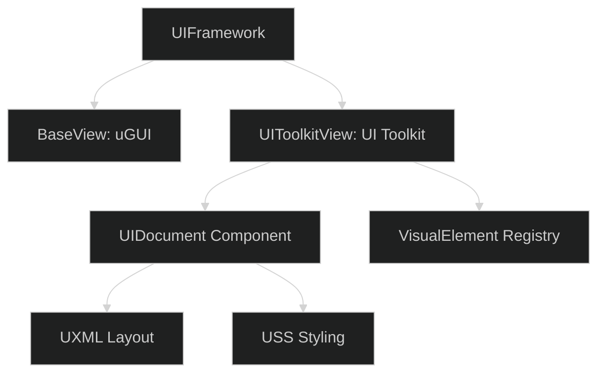
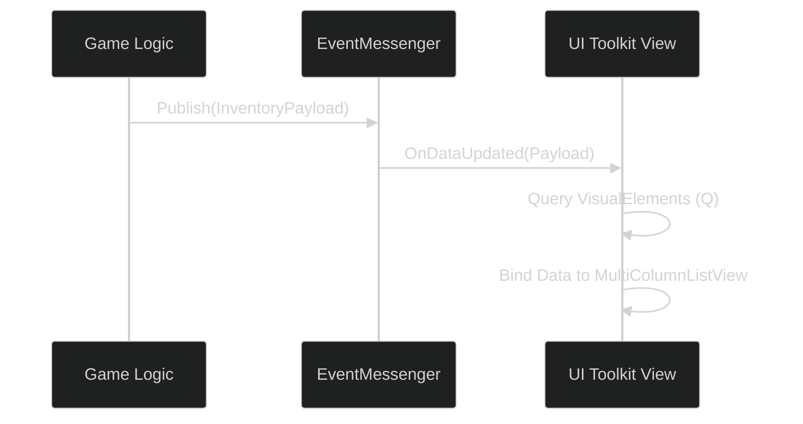

# UI Toolkit Integration Guide

To achieve the best possible performance and modern Unity DX, the **OneUI** framework can be extended to support **UI Toolkit** (USS/UXML) alongside legacy uGUI. This guide explains how to bridge the two systems.

---

## 1. Architectural Bridge

The bridge is achieved by creating a specialized `UIToolkitBaseView` that inherits from the existing `BaseView` but overrides the rendering logic to use a `UIDocument` instead of a `Canvas`.



### Implementation Pattern:
```csharp
public class InventoryView : BaseView {
    [SerializeField] private UIDocument m_Document;
    
    // Binding the UI Toolkit elements to the OneUI lifecycle
    public override void OnViewStart() {
        var root = m_Document.rootVisualElement;
        var closeButton = root.Q<Button>("CloseButton");
        closeButton.clicked += () => UIFramework.GoBack();
    }
}
```

---

## 2. When to Use UI Toolkit

While **uGUI** (OneUI/Modular Kit) is excellent for visual flair and pixel-perfect positioning, **UI Toolkit** should be prioritized for:
- **Data-Heavy Lists**: Large inventories, leaderboards, or quest logs.
- **Dynamic Layouts**: Complex menus that resize based on screen orientation or content length.
- **Tools & Settings**: Standardized forms that benefit from USS styling.

---

## 3. Communication Strategy

The `EventMessenger` remains the source of truth. UI Toolkit views subscribe to the same payloads as uGUI views.



---

## 4. Performance Optimization

1. **Lazy Binding**: Only query `VisualElement` references ($Q$) inside `OnViewStart`.
2. **Panel Settings**: Ensure that multiple `UIDocument` components share the same **PanelSettings** asset to reduce draw calls and memory overhead.
3. **Usage Profiling**: Use the **UI Toolkit Debugger** to identify over-draw and layout recalculations.

> [!TIP]
> Use the **OneUI Navigation History** to manage UI Toolkit focus. When a `UIDocument` is shown, ensure it captures pointer events correctly by setting the `PickingMode` on its root element.
