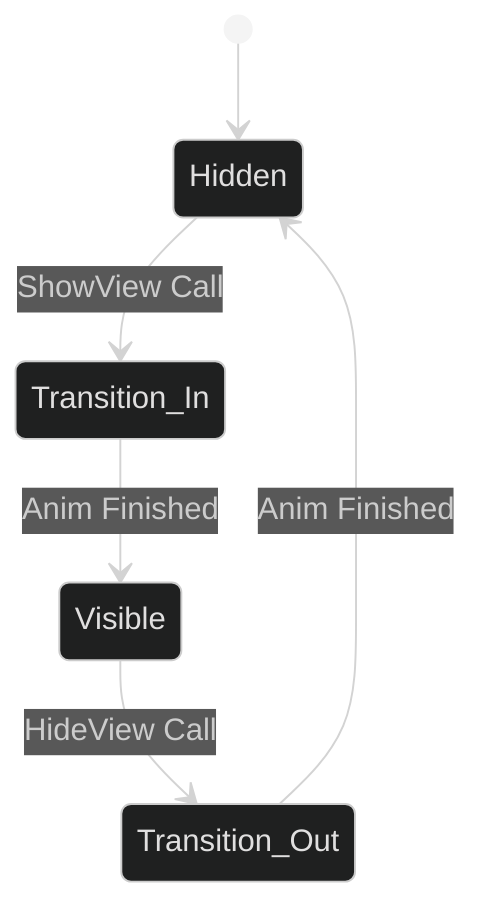

# View Animation States

The **OneUI** system uses a procedural state-machine approach for view transitions. Standardizing these states ensures that the UI feels fluid and reactive across all platforms.

---

## 1. The Transition Lifecycle

Animations are governed by the `AnimateView` coroutine and the `DisplayOptions` configuration.



### Standard Transition Parameters:
| Property          | Value            | Description                                              |
| :---------------- | :--------------- | :------------------------------------------------------- |
| **Duration**      | 0.25s - 0.4s     | Standard "snappy" transition speed.                      |
| **Delay**         | 0.0s             | Should be used only for sequential "cascading" UI lists. |
| **AnimationType** | `Fade` / `Scale` | `Fade` for main screens; `Scale` for modal alerts.       |

---

## 2. Animation Implementations

### Fade Transition (`AnimationType.Fade`)
- **Action**: Interpolates `CanvasGroup.alpha` from 0 to 1.
- **Requirement**: The root GameObject must have a `CanvasGroup` component.
- **Benefit**: Lowest rendering overhead for large UI hierarchies.

### Scale Transition (`AnimationType.Scale`)
- **Action**: Interpolates `transform.localScale` from `Vector3.zero` to `Vector3.one`.
- **Easing**: Use a slight overshoot for a "Pop" effect (requires custom animation curve support).

---

## 3. The `DisplayOptions` Contract
Used to pass specific transition logic to the `UIFramework.Navigate` method.

```csharp
UIFramework.Navigate(myView, new DisplayOptions {
    IsAnimated = true,
    Duration = 0.5f,
    Type = AnimationType.Scale,
    OnComplete = (visible) => Debug.Log("Transition Complete")
});
```

---

## 4. Best Practices for High DX

1. **Snap over Smooth**: Fast transitions (250ms) always feel more "Premium" than long, drawn-out animations.
2. **Handle Interruption**: The system automatically calls `StopCoroutine` before starting a new transition to prevent state flickering.
3. **Ghost Input Prevention**: During `Transition_In` and `Transition_Out`, the `blocksRaycasts` flag is set to `false` automatically by `BaseView`.

> [!TIP]
> To create custom easing (e.g., Bounce or Cubic), extend the `DisplayOptions` class to include an `AnimationCurve` field and use `curve.Evaluate(elapsedTime / duration)` in the `AnimateView` loop.
