# CharqUI Architecture: The Hybrid Reactive System

**CharqUI** (pronunced "Shark UI") is a high-performance, developer-centric UI framework for Unity. It re-conditions **DevsDaddy.OneUI** (Architecture) and **Modular Game UI Kit** (Visuals) into a modern **MVVM-Reactive** hybrid.

---

## 1. Core Architectural Pillars

| Pillar               | Technical Implementation             | Goal                                          |
| :------------------- | :----------------------------------- | :-------------------------------------------- |
| **Reactive Logic**   | MVVM with **R3** Observables         | Zero-allocation data binding & sync.          |
| **Global Messaging** | **VitalRouter** Command Bus          | Standardized unidirectional control flow.     |
| **Hybrid Rendering** | uGUI (VFX) + UI Toolkit (Data Lists) | Surgical performance optimization.            |
| **Unified Input**    | `IInputProvider` Abstraction Layer   | Support Legacy & New Input System seamlessly. |

---

## 2. System Topology

```mermaid
---
config:
  theme: dark
---
graph TD
    subgraph Logic_Layer [C# Logic - No Unity Refs]
        A[Data Model] --> B[R3 ViewModels]
    end

    subgraph Bridge_Layer [CharqUI Core]
        B --> C[View Binder]
        H[VitalRouter] -->|Commands| B
        D[IInputProvider] --> E[Input Bridge]
    end

    subgraph View_Layer [Unity Presentation]
        C --> F[ReactiveBaseView]
        F --> G[uGUI + Le Tai FX]
        F --> I[UI Toolkit]
        E --> F
    end

    style Bridge_Layer fill:#2d4a53,stroke:#3fb9b4
```



---

## 3. The "Re-conditioned" Components

CharqUI builds on top of your existing assets to ensure zero wasted work:

### OneUI -> CharqUI Core
- **`UIFramework`**: Remains the static navigator, but is upgraded to handle `ReactiveBaseView` and **VitalRouter** maps.
- **`EventMessenger`**: **DEPRECATED**. Replaced by global `VitalRouter` command publishing.
- **`BaseView` -> `ReactiveBaseView<T>`**: Upgraded with **R3** subscription management and automated command routing.

### Modular Kit -> CharqUI Visuals
- **`Ricimi.Gradient`**: Re-conditioned into a `ThemeSubscriber` that reacts to global theme changes.
- **`Popup` / `Transition`**: Extracted and integrated into the `CharqUI.Animation` module.

---

## 4. Technical Implementation Samples

### Sample 1: The Reactive Base (using R3)
```csharp
public abstract class ReactiveBaseView<T> : BaseView where T : ViewModel {
    protected T ViewModel;
    protected readonly CompositeDisposable Disposables = new();

    public void Initialize(T viewModel) {
        ViewModel = viewModel;
        OnBind(); 
    }

    protected abstract void OnBind();

    protected virtual void OnDestroy() => Disposables.Dispose();
}
```

### Sample 2: VitalRouter & R3 Binding
```csharp
[Routes]
public partial class ProfileHeader : ReactiveBaseView<UserViewModel> {
    [SerializeField] private TextMeshProUGUI nameLabel;

    protected override void OnBind() {
        // R3 Data Binding
        ViewModel.UserName
                 .Subscribe(name => nameLabel.text = name)
                 .AddTo(Disposables);
    }

    // Unidirectional command flow
    public void OnClickLogout() {
        Router.Default.PublishAsync(new LogoutCommand()).Forget();
    }
}
```

### Sample 3: Dual-Input Support
```csharp
public class MainMenuNavigator : ReactiveBaseView<MenuViewModel> {
    void Update() {
        // System-agnostic input
        if (InputBridge.Instance.GetButtonDown("Confirm")) {
            ViewModel.ExecuteAction();
        }
    }
}
```

---

## 5. Integration Strategy (Sample Phases)

To demonstrate the power of CharqUI, we will build three distinct samples:

1.  **Sample A (Legacy Refit)**: A 1:1 conversion of a OneUI Demo screen to a Reactive version.
2.  **Sample B (Visual Modernization)**: A screen using only Modular Kit procedural assets bound to a CharqUI ViewModel.
3.  **Sample C (The "Shark" Suite)**: A complex inventory screen using **UI Toolkit** for the list, **uGUI** for the item details, and **Input Bridge** for controller support.

---

> [!IMPORTANT]
> CharqUI is designed so that if Unity releases a "new" rendering engine tomorrow, you only need to update the **View Layer**. Your business logic (ViewModels) remains 100% portable.
