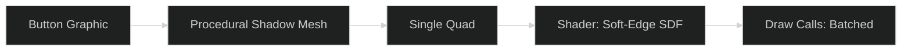

# CharqUI Visual Effects Optimization Guide

This document defines the high-performance standards for implementation of **Blur**, **Shadows**, and **Text Effects** within the CharqUI framework.

---

## 1. Backdrop Blur (The "Glass" Effect)

Standard shader blurs (like OneUI's `FASTBLUR`) only blur the graphic's own texture. For a performant "Glassmorphism" look, use a **Dual-Filtering Downsample** approach.

### The Recommended Solution
1.  **Rendering Engine**: Use a **Scriptable Render Pass (URP)** to capture a "Blit" of the screen at 1/4 or 1/8 resolution.
2.  **Shader**: Apply a horizontal and vertical blur on that low-res texture.
3.  **UI Component**: A custom `GlassPanel` component samples this global `_GlobalBackgroundBlur` texture instead of using a `GrabPass`.

| Method                     | Performance       | Visual Quality            | Verdict             |
| :------------------------- | :---------------- | :------------------------ | :------------------ |
| **GrabPass Shader**        | 🔴 Low (CPU stall) | 🟢 High                    | **AVOID**           |
| **BISS (OneUI)**           | 🟢 High            | 🔴 Low (Only blurs itself) | Use for icons only. |
| **Dual Filter Blit (URP)** | 🟢 High            | 🟢 High                    | **RECOMMENDED**     |

---

## 2. Button & Panel Shadows

Shadows in Unity UI are notoriously expensive due to geometry duplication.

### The Recommended Solution: "Procedural SDF Shadows"
Instead of the `UIShadow` (OneUI) which duplicates triangles, use the **Modular Kit's Procedural Mesh** approach with an SDF-based shader.

-   **Why?**: One mesh with a specific vertex-gradient can simulate a smooth shadow without adding 4x the triangles.
-   **Implementation**: Use the `ProceduralGradient` from the Modular Kit and extend it to support "Inner" and "Outer" glow states.

---

## 3. Font Shadows & Glow (TextMeshPro)

For text, **never** use the `Shadow` or `Outline` components from uGUI.

### The Recommended Solution: "SDF Material Presets"
TextMeshPro (TMP) uses Signed Distance Fields. This allows for shadows and glows that cost **zero extra triangles**.

1.  **Material Presets**: Create a "MainHeader_Shadowed" material preset in TMP.
2.  **Underlay**: Enable the "Underlay" feature in the TMP material.
3.  **Dilate/Softness**: Adjust these to get the perfect drop-shadow or glow.

---

## 4. Performance Checklist

- [ ] **Blur**: Is the blur texture downsampled? (1/4 res is usually enough).
- [ ] **Shadows**: Are you using `Shadow` components? *If yes, replace with SDF or 9-sliced sprites for large lists.*
- [ ] **Batching**: Do your blur/shadow panels share the same Material?
- [ ] **Overdraw**: Disable the `Graphic` component on transparent shadow holders to save GPU fill rate.

---

## 5. Custom vs. Paid Assets (Le Tai / Tai's Assets)

If your project has the budget, **Translucent Image** and **True Shadow** from Le Tai are the industry standards for these effects.

| Metric                 | CharqUI Custom (Free)     | Le Tai Assets (Paid)                     |
| :--------------------- | :------------------------ | :--------------------------------------- |
| **Shadow Quality**     | Good (SDF Quads)          | **Elite** (Optimized Softness API)       |
| **Shadow Performance** | High (Batchable)          | **Highest** (Highly optimized shaders)   |
| **Blur Quality**       | Good (Dual Filter)        | **Elite** (Kawase / Multi-pass Gaussian) |
| **Ease of Use**        | 🟡 Moderate (Manual Setup) | 🟢 High (Drag & Drop)                     |
| **Project Weight**     | 🟢 Zero (Internal)         | 🟡 Minor (External DLLs/Shaders)          |

### When to buy Le Tai's Assets?
1.  **You need "Mobile-First" extreme optimization**: His assets are heavily profiled for low-end Android/iOS.
2.  **You have a complex glowing UI**: True Shadow handles multiple overlapping glows better than a standard SDF quad.
3.  **You want "Instant Glass"**: Translucent Image handles the complex URP blit setup and UI-layering issues automatically.

### When to stick with CharqUI Custom?
1.  **Zero Budget**: You want to keep the toolchain 100% open or proprietary.
2.  **Ultra-Lightweight**: You only need 1 or 2 blurred panels and don't want the overhead of a full 3rd party asset package.
3.  **Learning/Control**: You want to deep-tune the shaders specifically for your game's unique look.

---

## 6. Architectural Impact: Custom vs. Paid

Supporting these effects correctly impacts the **Bridge Layer** and **View Layer** of CharqUI.

| Feature      | Custom Implementation Impact                                                         | Paid Asset (Tai) Impact                                                      |
| :----------- | :----------------------------------------------------------------------------------- | :--------------------------------------------------------------------------- |
| **Blur**     | **High**: Requires custom URP Renderer Feature logic inside `UIFramework`.           | **Low**: Handled by asset's own component; needs a simple interface wrapper. |
| **Shadows**  | **High**: Requires procedural quad-generation code in `ReactiveBaseView`.            | **Low**: Drag-and-drop component; works out of the box with uGUI.            |
| **Batching** | **High**: You must manually manage a `GlobalMaterial` pool to ensure elements batch. | **Low**: Tai's shaders are pre-optimized to batch with each other.           |
| **Overdraw** | **Same**: Both require the "Raycast Target" management policy in the View.           | **Same**: Both require the "Raycast Target" management policy in the View.   |

### Summary of Changes required to [CharqUI Architecture](charqui-architecture.md):

1.  **If Custom**: We must add a **"Rendering Module"** to the Core. This increases internal project complexity but keeps the framework "One-Click Install."
2.  **If Paid Assets**: We must add a **"Plugin Bridge"** layer. This keeps the core lightweight but introduces's a setup step where the dev must import the 3rd party packages.

> [!IMPORTANT]
> **Conclusion**: The **Custom** path requires significantly more changes to the architecture (Internal Shaders, Mesh API, Pipeline management). The **Paid** path is architecturally "Cleaner" because it delegates the heavy lifting to specialized modules, requiring only a simple set of Wrapper Scripts to maintain decoupling.

---

> [!TIP]
> **CharqUI Standard**: Visual effects should be "Data-Driven." Use the `ReactiveBaseView` to toggle a `BlurFactor` property on your ViewModel, which then updates the shader's `_EffectAmount` globally.
