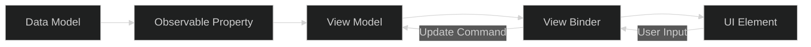
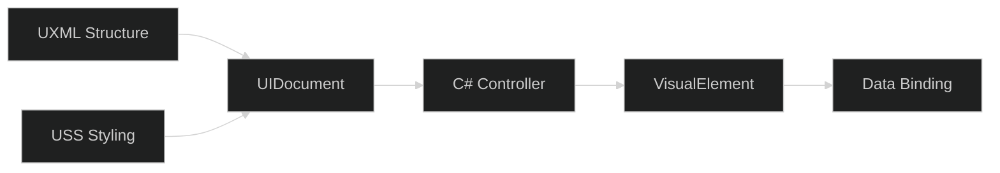
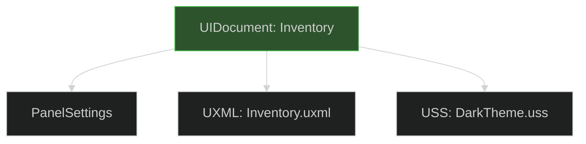
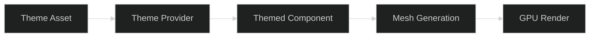
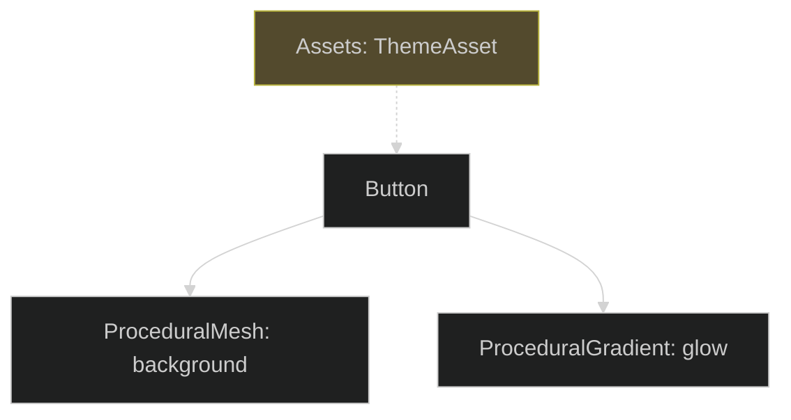
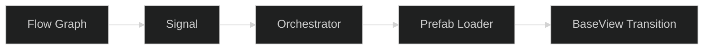
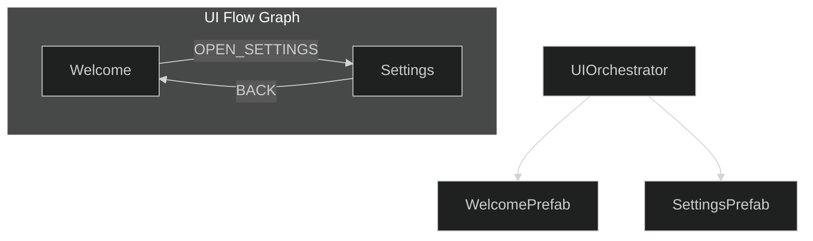

# UI Architectural Concepts: Comparative Analysis

Choosing the right architectural pattern is the single most important decision for long-term project health. This document provides a multi-dimensional comparison of 5 proposed concepts for your new UI system.

---

## 1. Executive Summary Table

| Concept                  | Developer Experience (DX) | Performance    | Complexity (Build Time) | Best For...                      |
| :----------------------- | :------------------------ | :------------- | :---------------------- | :------------------------------- |
| **1. Mediated Reactive** | ⭐⭐⭐⭐⭐ (Excellent)         | ⭐⭐⭐⭐ (High)    | Moderate                | Large, data-driven apps / RPGs   |
| **2. State-Store**       | ⭐⭐⭐⭐ (Great)              | ⭐⭐⭐⭐⭐ (Elite)  | High                    | Complex apps with undo/redo      |
| **3. Toolkit Hybrid**    | ⭐⭐⭐⭐ (Modern)             | ⭐⭐⭐⭐⭐ (Elite)  | Moderate                | High-density lists & lists       |
| **4. Procedural Theme**  | ⭐⭐⭐ (Varies)              | ⭐⭐⭐⭐ (High)    | Low                     | Multi-SKU or highly visual games |
| **5. Blueprint Flow**    | ⭐⭐⭐⭐⭐ (Visual)            | ⭐⭐⭐ (Baseline) | High                    | Branching narratives / Heavy UX  |

---

## 2. Concept Deep-Dives

### Concept 1: The "Mediated Reactive" System (MVVM+)
Explicitly decouples the view from the data using "Binding" logic.

- **Pros**: 
  - Zero manual UI refreshes (`text.text = data` is gone).
  - Extremely easy to Unit Test (test the ViewModel, not the UI).
  - High DX: Devs only care about updating C# properties.
- **Cons**: 
  - Memory overhead from "Observable" wrappers.
  - Requires a robust binding engine (e.g., property reflection or `OnPropertyChanged` events).

#### Architecture Workflow


#### Example: Reactive Binding
```csharp
// ViewModel
public class PlayerState : ViewModel {
    public ReactiveProperty<int> Gold = new(100);
}

// View
public class GoldView : BindingView<PlayerState> {
    [SerializeField] private TextMeshProUGUI goldLabel;
    
    // Auto-bound via attribute or manual registration
    [Bind("Gold")] 
    private void OnGoldChanged(int newVal) => goldLabel.text = newVal.ToString();
}
```

#### Hierarchy & Inspector

```mermaid
---
config:
  theme: dark
---
graph TD
    A[Canvas] --> B[GoldDisplay: GoldView]
    B --> C[TextMeshPro: goldLabel]
    
    style B fill:#2d4a53,stroke:#3fb9b4
```

**Inspector View**: `GoldView` component has a "Source ViewModel" field and a list of "Active Bindings" showing which UI events are linked to which C# properties.

---

### Concept 2: The "State-Store" (Redux Style)
Centralizes all UI data into a single, immutable store.

- **Pros**: 
  - Perfectly predictable: You always know exactly why the UI looks a certain way.
  - State Serialization: Save the store, save the entire UI state perfectly.
  - Performance: Only re-renders "Dirty" slices of the state.
- **Cons**: 
  - High Boilerplate: Every update requires an "Action" and a "Reducer."
  - Overhead for simple screens.

#### Architecture Workflow


#### Example: Dispatching Actions
```csharp
// Action
public struct AddGoldAction : IAction { public int Amount; }

// Dispatch from Button
public void OnClick() => UIStore.Main.Dispatch(new AddGoldAction { Amount = 10 });

// View Component
public class GoldCounter : StoreSubscriber {
    public void OnStateChange(AppState state) {
        if(state.IsDirty(s => s.Currency.Gold)) {
            label.text = state.Currency.Gold.ToString();
        }
    }
}
```

#### Hierarchy & Inspector

```mermaid
---
config:
  theme: dark
---
graph TD
    A[GlobalUI: UIStore] --> B[Canvas]
    B --> C[Label: GoldCounter]
    
    style A fill:#4a2d53,stroke:#b43fb9
```

**Inspector View**: `UIStore` shows a "Store Debugger" list of all recent Actions (e.g., `AddGoldAction`) and the current Snapshot of the entire UI state tree.

---

### Concept 3: The "UI Toolkit-First" Hybrid
Uses Unity's modern UI Toolkit as the default, only falling back to uGUI for specialized 3D effects.

- **Pros**: 
  - Native performance: No Canvas Rebuilds.
  - CSS-like styling (USS) simplifies global design changes.
  - Faster UI construction via UXML.
- **Cons**: 
  - Learning curve (new paradigm).
  - Limited 3D/VFX integration compared to uGUI.

#### Architecture Workflow


#### Example: UXML Querying
```csharp
public class InventoryView : UIToolkitView {
    void OnEnable() {
        var root = GetComponent<UIDocument>().rootVisualElement;
        // Query like CSS
        var list = root.Q<ListView>("ItemList");
        list.makeItem = () => new ItemRow();
        list.bindItem = (e, i) => (e as ItemRow).Init(items[i]);
    }
}
```

#### Hierarchy & Inspector

**Inspector View**: Minimal GameObject hierarchy. The complexity is hidden inside the **UI Builder** window, showing a flat `VisualElement` tree and a list of applied USS Classes (`.button-primary`, `.label-header`).

---

### Concept 4: The "Procedural Theme" Engine
Drives all visual styles through code and ScriptableObjects rather than textures.

- **Pros**: 
  - Ultra-low project size (MBs saved).
  - Design flexibility: Swap colors project-wide in seconds.
  - GPU friendly: Uses standard shaders and simple meshes.
- **Cons**: 
  - Harder for traditional "2D Artists" to contribute to (needs technical art knowledge).
  - Can be CPU heavy if mesh generation isn't optimized.

#### Architecture Workflow


#### Example: Global Styling
```csharp
[CreateAssetMenu]
public class UITheme : ScriptableObject {
    public Color PrimaryColor;
    public float CornerRadius;
}

public class ThemedButton : MonoBehaviour {
    void OnValidate() {
        var grad = GetComponent<ProceduralGradient>();
        grad.color = ThemeProvider.Current.PrimaryColor;
        // Mesh generated on-demand
    }
}
```

#### Hierarchy & Inspector

**Inspector View**: The `Button` component doesn't have an "Image" field for a sprite; instead, it has a "Theme Key" popup. Changing the `ThemeAsset` instantly updates every element in the Hierarchy.

---

### Concept 5: The "Blueprint Flow" Orchestrator
Uses a visual graph to manage transitions and navigation logic.

- **Pros**: 
  - Visual clarity: See every possible screen transition.
  - Easy for Designers to manage logic without code.
  - Enforces a strict "Go Back" and "Home" discipline.
- **Cons**: 
  - Requires custom Editor tooling.
  - Graph "Spaghetti" can occur if not disciplined.

#### Architecture Workflow


#### Example: Signal-Based Navigation
```csharp
// No hard references in code!
public void OnSettingsPressed() {
    // Just send a signal; the Graph handles the transition
    NavigationGraph.Main.TriggerSignal("OPEN_SETTINGS");
}
```

#### Hierarchy & Inspector

**Inspector View**: `UIOrchestrator` component contains a "Flow Asset" field. Clicking it opens a custom Editor Window (Node Graph) where you drag-and-drop Views and connect them with arrows representing "Close Current & Open Next" logic.

---

## 3. Evaluation Metrics

### Developer Experience (DX)
The **Mediated Reactive** system wins for pure code speed, while the **Blueprint Flow** wins for project management visibility.

### Performance
The **Redux Store** and **UI Toolkit Hybrid** share the top spot. Redux prevents C# overhead; UI Toolkit prevents Unity rendering overhead.

### Complexity & Maintenance
The **Procedural Theme** engine is the simplest to maintain visually, but the **Redux Store** is the easiest to maintain logically over 12+ months of development.

---

## 4. Recommendation

1.  **For Scalability**: Choose **Mediated Reactive (MVVM)**. It is the most robust balance of speed and cleanliness.
2.  **For Performance**: Choose **UI Toolkit First**. It's the future of Unity UI.
3.  **For Visual Wow**: Combine **Procedural Theme** with any of the above.

---

---

> [!TIP]
> **Next Step**: Select one or two concepts that fit your vision. I will then expand them into full **[IdeaName]-architecture.md** documents with detailed class diagrams and implementation steps.
> Check out the [Detailed UI Recommendations](design/ui-architectural-concepts-recommendation.md) and [Concept Re-conditioning Template](design/ui-architectural-concepts-template.md) for more.
