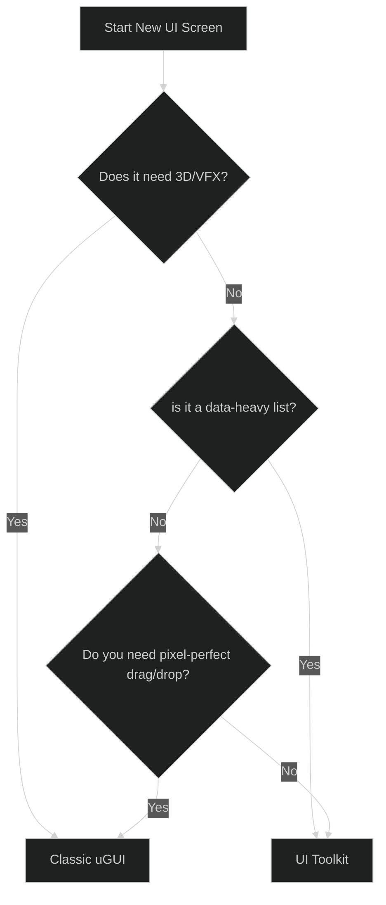

# UI Architectural Recommendations: The "Pro" Hybrid Strategy

After auditing the existing kits and evaluating multiple architectural patterns, I recommend a **Hybrid Reactive Strategy**. This approach maximizes Developer Experience (DX) while ensuring surgical performance on mobile and desktop platforms.

---

## 1. The Recommended Stack

The "Pro" Hybrid strategy combines three distinct concepts into a single cohesive system:

| Layer                     | Responsibility             | Technology                   |
| :------------------------ | :------------------------- | :--------------------------- |
| **Logic (Brain)**         | State Management & Binding | **Mediated Reactive (MVVM)** |
| **Layout (High Density)** | Complex Lists, Inventories | **UI Toolkit (UXML/USS)**    |
| **Layout (High Visual)**  | HUD, World-Space, VFX      | **Classic uGUI**             |
| **Visual Style**          | Dynamic Gradients & Shapes | **Procedural Theme Engine**  |

---

## 2. Rationale: Why this mix?

### Why MVVM (Mediated Reactive)?
OneUI's current `EventMessenger` is a great start, but it requires too much boilerplate to update individual labels. MVVM removes the need for manual "UI Refresh" code. It creates a **clean separation** where the logic doesn't know the UI exists.

### Why UI Toolkit for "Heavy" Screens?
Classic uGUI is notorious for "Canvas Rebuild" spikes. UI Toolkit's layout engine is built on standard CSS Flexbox logic, which is significantly more efficient for scrolling lists and complex nested layouts.

### Why Procedural Themes?
Using textures for every button variant (Blue, Red, Glowing) kills draw-call batching. Procedural meshes (from the Modular Kit) allow you to have **infinite visual variety** with a single material.

---

## 3. Decision Matrix: Classic uGUI vs. UI Toolkit

Use this guide for every new feature you build:

| Use **Classic uGUI** When...                 | Use **UI Toolkit** When...                     |
| :------------------------------------------- | :--------------------------------------------- |
| Needs World-Space placement.                 | Needs fast, web-like layout iteration.         |
| Uses complex Shaders or Particle Effects.    | Has long scrolling lists (100+ items).         |
| Needs deep integration with 3D models.       | Needs a consistent design system (CSS).        |
| You need rapid "inspector-only" prototyping. | You want to minimize CPU "Main Thread" spikes. |

---

## 4. The Migration Path

You don't need to rewrite everything today. Follow this staged approach to adapt your current kits:

1.  **Stage 1 (Adaptive)**: Keep OneUI's `UIFramework` but start wrapping your View data in **Reactive Properties**.
2.  **Stage 2 (Modular)**: Use the Modular Kit's `Gradient.cs` and `Popup.cs` logic as "Visual Plugins" for your uGUI views.
3.  **Stage 3 (Modernize)**: Create your next complex inventory screen using **UI Toolkit** and bind it to the same reactive logic used for your uGUI screens.

---

> [!IMPORTANT]
> The goal is **Logic Portability**. By using a Mediated Reactive "Brain," you can swap the "Body" (uGUI vs. UI Toolkit) without ever rewriting your business logic.
