# Attributes Utility: Supplemental Property Logic

The Attributes Utility is a lightweight collection of customPropertyAttributes used to handle specific UI configuration cases not covered by larger frameworks. It provides targeted inspector enhancements for the CharqUI system.

---

## 1. Visual File Tree

Attributes/
└── ConditionalFieldoAttribute.cs

---

## 2. Detailed Registry Table

| Directory | Purpose                                                  | Key .cs Files                                                                                                    |
| :-------- | :------------------------------------------------------- | :--------------------------------------------------------------------------------------------------------------- |
| **Root**  | Supplemental attributes for targeted inspector controls. | [ConditionalFieldoAttribute.cs](file:///d:/ware/CharqUI/Assets/Plugins/Attributes/ConditionalFieldoAttribute.cs) |

---

## 3. Technical Interaction Map

```mermaid
---
config:
  theme: dark
---
graph TD
    A[Serialized Field] -->|Marked with| B[ConditionalFieldoAttribute]
    B -->|Defines Logic| C[Property Drawer]
    C -->|Reads Condition| D[Target Field Value]
    D -->|Toggle| E[Inspector Visibility]

    style A fill:#2d4a53,stroke:#3fb9b4
```



---

## 4. Core Logic / Lifecycle

- **Conditional Logic**: The specifically named `ConditionalFieldoAttribute` allows for inverse logic (`bool Inverse`) to show/hide fields based on the state of another peer field.
- **Simplistic Architecture**: Unlike larger suites, this is a "single-purpose" attribute designed for high-performance, low-dependency field toggling.

---

## 5. Features

*   **Conditional Visibility (Inverse Support)**: Show or hide fields based on a boolean condition, with a built-in toggle for inverse logic.
*   **Zero-Dependency**: Does not require large frameworks like Odin or AwesomeAttributes to function.
*   **CharqUI Optimized**: Specifically used for low-level UI configuration where framework overhead must be minimal.

---

## 6. Usage Example

### Using [ConditionalFieldo]
```csharp
public class ZoomSettings : MonoBehaviour 
{
    public bool useDefaultZoom = true;

    // Only shows if useDefaultZoom is FALSE
    [ConditionalFieldo(nameof(useDefaultZoom), inverse: true)]
    public float customZoomLevel;
}
```

---

> [!NOTE]
> This folder serves as a landing zone for project-specific custom attributes that do not belong in the broader `AwesomeAttributes` suite.
