# BetterFolders: Project Organization Architecture

BetterFolders provides a streamlined way to visually organize the Unity Project window by assigning custom colors and icons to folders. While primarily an Editor-only tool, it improves the developer experience (DX) within the CharqUI project structure.

---

## 1. Visual File Tree

BetterFolders/
└── Editor/
    ├── FolderColorEditWindow.cs
    ├── FolderColorSettings.cs
    ├── FolderColorSettingsEditor.cs
    └── FolderColors.cs

---

## 2. Detailed Registry Table

| Directory  | Purpose                                                                       | Key .cs Files                                                                                                                                                                                                |
| :--------- | :---------------------------------------------------------------------------- | :----------------------------------------------------------------------------------------------------------------------------------------------------------------------------------------------------------- |
| **Editor** | Core logic for defining folder colors and rendering them in the Project view. | [FolderColors.cs](file:///d:/ware/CharqUI/Assets/Plugins/BetterFolders/Editor/FolderColors.cs), [FolderColorSettings.cs](file:///d:/ware/CharqUI/Assets/Plugins/BetterFolders/Editor/FolderColorSettings.cs) |

---

## 3. Technical Interaction Map

```mermaid
---
config:
  theme: dark
---
graph TD
    A[Unity Project Window] -->|Paints Item| B[BetterFolders Logic]
    B -->|Queries| C[FolderColorSettings ScriptableObject]
    C -->|Maps GUID| D[Specific Color/Icon]
    D -->|Renders| A

    style B fill:#2d4a53,stroke:#3fb9b4
```

---

## 4. Core Logic / Lifecycle

- **OnPostRenderProjectWindow**: Hooks into the Unity Editor's project window rendering loop to inject custom icons/colors onto specific folder GUIDs.
- **Persistence**: Color mappings are stored in a `FolderColorSettings` ScriptableObject, allowing the custom organization to persist across team-mates via version control.
- **GUID Based**: Unlike name-based folder tools, BetterFolders uses GUIDs, meaning you can rename folders without losing their color assignments.

---

## 5. Features

*   **Custom Color Overlay**: Apply vibrant colors to folder icons to highlight core directories (e.g., `Scripts` in green, `Assets` in blue).
*   **Icon Customization**: Swap standard folder icons with specialized symbols for better scannability.
*   **Recursive Styling**: Optionally apply styles to all sub-folders of a specific path.
*   **Project-Wide Settings**: Shared `FolderColorSettings` ensures the entire team sees the same organized hierarchy.

---

> [!NOTE]
> BetterFolders is purely an **Editor** plugin. It has zero impact on runtime performance or build size.
