# Le Tai's Asset: Visual FX Architecture

Le Tai's Asset is a suite of high-performance UI visual effects for Unity, primarily featuring **Translucent Image** (blur) and **True Shadow** (soft shadows). It serves as the visual "soul" of CharqUI, providing mobile-optimized, elite-grade aesthetics with minimal performance overhead.

---

## 1. Visual File Tree

Le Tai's Asset/
├── Common/
│   ├── Editor/
│   │   ├── Assets.cs
│   │   └── EditorUtils.cs
│   └── Runtime/
│       ├── MaterialUtils.cs
│       └── TinyTween.cs
├── TranslucentImage/
│   ├── Script/
│   │   ├── BlurAlgorithm/
│   │   │   ├── IBlurAlgorithm.cs
│   │   │   └── ScalableBlur.cs
│   │   ├── TranslucentImage.cs
│   │   └── TranslucentImageSource.cs
│   └── Demo/
└── TrueShadow/
    ├── Script/
    │   ├── TrueShadow.cs
    │   └── TrueShadowSource.cs
    └── Demo/

---

## 2. Detailed Registry Table

| Directory            | Purpose                                                          | Key .cs Files                                                                                                                                                                                                                                                              |
| :------------------- | :--------------------------------------------------------------- | :------------------------------------------------------------------------------------------------------------------------------------------------------------------------------------------------------------------------------------------------------------------------- |
| **Common**           | Shared utilities for rendering, editor tools, and math.          | [MaterialUtils.cs](file:///d:/ware/CharqUI/Assets/Plugins/Le%20Tai's%20Asset/Common/Runtime/MaterialUtils.cs), [TinyTween.cs](file:///d:/ware/CharqUI/Assets/Plugins/Le%20Tai's%20Asset/Common/Runtime/TinyTween.cs)                                                       |
| **TranslucentImage** | Core logic for background blurring and "Glassmorphism" effects.  | [TranslucentImage.cs](file:///d:/ware/CharqUI/Assets/Plugins/Le%20Tai's%20Asset/TranslucentImage/Script/TranslucentImage.cs), [TranslucentImageSource.cs](file:///d:/ware/CharqUI/Assets/Plugins/Le%20Tai's%20Asset/TranslucentImage/Script/TranslucentImageSource.cs)     |
| **TrueShadow**       | Optimized soft shadow and glow generation specifically for uGUI. | [TrueShadow.cs](file:///d:/ware/CharqUI/Assets/Plugins/Le%20Tai's%20Asset/TrueShadow/Script/TrueShadow.cs)                                                                                                                                                                 |
| **BlurAlgorithm**    | Abstraction and implementation of various blurring kernels.      | [IBlurAlgorithm.cs](file:///d:/ware/CharqUI/Assets/Plugins/Le%20Tai's%20Asset/TranslucentImage/Script/BlurAlgorithm/IBlurAlgorithm.cs), [ScalableBlur.cs](file:///d:/ware/CharqUI/Assets/Plugins/Le%20Tai's%20Asset/TranslucentImage/Script/BlurAlgorithm/ScalableBlur.cs) |

---

## 3. Technical Interaction Map

```mermaid
---
config:
  theme: dark
---
graph TD
    subgraph Capture [Screen Capture]
        A[TranslucentImageSource] -->|Capture| B[Post-Processing / Blit]
    end

    subgraph Process [Blur Logic]
        B -->|Downsample| C[IBlurAlgorithm]
        C -->|Iterate| D[Blurred Texture]
    end

    subgraph Display [UI Presentation]
        D -->|Sample| E[TranslucentImage Component]
        F[TrueShadow] -->|SDF/Gaussian| G[uGUI Shadow Overlay]
    end

    style Capture fill:#2d4a53,stroke:#3fb9b4
    style Process fill:#1e3a44,stroke:#3fb9b4
```



---

## 4. Core Logic / Lifecycle

- **Translucent Image Heartbeat**:
  - `TranslucentImageSource` captures the screen at a specified `RenderPassEvent`.
  - The captured texture is **downsampled** and passed through an `IBlurAlgorithm` (e.g., ScalableBlur).
  - Individual `TranslucentImage` components sample this shared blurred texture locally.
- **True Shadow Heartbeat**:
  - Monitors the `Graphic` component's geometry (Sprite, Text, etc.).
  - Generates a cached shadow mesh/texture based on an optimized Gaussian or SDF-like algorithm.
  - Efficiently batches multiple shadows that share similar parameters.

---

## 5. Key Features

### Translucent Image (Blur)
*   **Real-time Background Blur**: High-performance "Glassmorphism" effect for mobile and desktop.
*   **Custom Blur Kernels**: Supports Scalable Blur (Kawase-like) and other optimized algorithms.
*   **Downsampling Control**: Dramatically reduce GPU cost by blurring at lower resolutions.
*   **Multiple Sources**: Support for different cameras or UI layers as blur sources.

### True Shadow (Soft Shadows)
*   **Real-time Soft Shadows**: Smooth, resolution-independent shadows for uGUI.
*   **Glow & Inner Shadow**: Built-in support for multiple shadow styles.
*   **Geometry-Aware**: Automatically adjusts to Sprite masks, Text mesh, and complex RectTransforms.
*   **Batch-Friendly**: Optimized to share materials across multiple shadow instances.

---

## 6. C# API Examples

### Adjusting Blur Intensity at Runtime
```csharp
using LeTai.Asset.TranslucentImage;
using UnityEngine;

public class BlurController : MonoBehaviour 
{
    public TranslucentImage blurPanel;
    
    public void SetBlurStrength(float strength) 
    {
        // Adjust the size/strength of the blur kernel
        var config = blurPanel.source.Config as ScalableBlurConfig;
        if (config != null) config.Radius = strength;
    }
}
```

### Programmatic Shadow Modification
```csharp
using LeTai.Asset.TrueShadow;
using UnityEngine;

public class ShadowController : MonoBehaviour 
{
    public TrueShadow shadow;
    
    public void PulseShadow(float intensity) 
    {
        // Update shadow color and distance dynamically
        shadow.Color = new Color(0, 0, 0, intensity);
        shadow.Offset = new Vector2(intensity * 5, -intensity * 5);
    }
}
```

---

> [!NOTE]
> All Le Tai assets are optimized for URP (Universal Render Pipeline). Ensure that "Opaque Texture" is enabled in your URP Asset settings for background blurring to function.

> [!IMPORTANT]
> To maximize batching in CharqUI, avoid frequently changing individual shadow properties. Instead, use shared material presets for common button/panel styles.
