# LokoSolo: UI Interaction Architecture (PinchableScrollRect)

LokoSolo provides specialized UI interaction components, primarily the **PinchableScrollRect**. This system enables mobile-first gestures (pinch-to-zoom) for standard Unity UI containers, enhancing the interactivity of CharqUI views like Maps or Zoomable Inventories.

---

## 1. Visual File Tree

LokoSolo/
└── PinchableScrollRect/
    └── Runtime/
        ├── Utilities/
        │   └── PinchInputForwarder.cs
        ├── IPinchHandler.cs
        ├── PinchInputDetector.cs
        └── PinchableScrollRect.cs

---

## 2. Detailed Registry Table

| Directory     | Purpose                                                     | Key .cs Files                                                                                                                                                                                                                                            |
| :------------ | :---------------------------------------------------------- | :------------------------------------------------------------------------------------------------------------------------------------------------------------------------------------------------------------------------------------------------------- |
| **Runtime**   | Core interactive components for pinch and scroll gestures.  | [PinchableScrollRect.cs](file:///d:/ware/CharqUI/Assets/Plugins/LokoSolo/PinchableScrollRect/Runtime/PinchableScrollRect.cs), [PinchInputDetector.cs](file:///d:/ware/CharqUI/Assets/Plugins/LokoSolo/PinchableScrollRect/Runtime/PinchInputDetector.cs) |
| **Utilities** | Helper classes for input forwarding and raycast management. | [PinchInputForwarder.cs](file:///d:/ware/CharqUI/Assets/Plugins/LokoSolo/PinchableScrollRect/Runtime/Utilities/PinchInputForwarder.cs)                                                                                                                   |

---

## 3. Technical Interaction Map

```mermaid
---
config:
  theme: dark
---
graph TD
    subgraph Input [Touch Events]
        A[Mobile Fingers] --> B[PinchInputDetector]
    end

    subgraph Logic [Gesture Analysis]
        B -->|Calculate Delta| C[PinchableScrollRect]
        C -->|Apply Scale| D[Content Transform]
    end

    subgraph Feedback [Visual Result]
        D -->|Zoom/Pan| E[uGUI Viewport]
    end

    style Input fill:#2d4a53,stroke:#3fb9b4
    style Logic fill:#1e3a44,stroke:#3fb9b4
```



---

## 4. Core Logic / Lifecycle

- **Multi-Touch Heartbeat**: The `PinchInputDetector` monitors for exactly two touch points. It calculates the mid-point and the relative distance change between frames.
- **Scale Clamping**: `PinchableScrollRect` allows for defining `MinScale` and `MaxScale` to prevent the UI from zooming into infinity.
- **Scroll Integration**: Extends the standard Unity `ScrollRect` to ensure that zooming and panning do not conflict with each other.

---

## 5. Features

*   **Pinch-to-Zoom**: Smooth scaling of any RectTransform using two-finger gestures.
*   **Dual Interaction**: Seamlessly switch between panning (one finger) and zooming (two fingers).
*   **Elastic Clamping**: Supports "bounce-back" logic when zooming past Min/Max limits.
*   **Raycast Filtering**: Automatically ignores gestures if they start on blocked UI elements.

---

## 6. Usage Example

### Programmatic Zoom Control
```csharp
using LokoSolo.UI;
using UnityEngine;

public class MapController : MonoBehaviour 
{
    public PinchableScrollRect mapScrollRect;

    public void ZoomToPoint(Vector2 position, float zoomLevel) 
    {
        // Smoothly pan and zoom to a specific coordinate
        mapScrollRect.SetZoom(zoomLevel, position);
    }
}
```

---

> [!NOTE]
> This plugin is highly dependent on the **Unity Input System** or standard `Input.touches`. In CharqUI, we recommend wrapping this in the `InputBridge` for maximum compatibility across platforms.
