# UI Particles: Visual Effects Architecture

UI Particles allows Unity's Shuriken Particle System to be rendered directly within the uGUI Canvas. This solves the "Layering" problem where standard particles always render behind or in front of the UI, allowing for immersive VFX integrated into CharqUI views.

---

## 1. Visual File Tree

UI Particles/
├── Runtime/
│   ├── Internal/
│   │   ├── Extensions/
│   │   └── Utilities/
│   ├── UIParticle.cs
│   ├── UIParticleRenderer.cs
│   └── UIParticleUpdater.cs
└── Editor/
    └── UIParticleEditor.cs

---

## 2. Detailed Registry Table

| Directory      | Purpose                                                            | Key .cs Files                                                                                                                                                                                              |
| :------------- | :----------------------------------------------------------------- | :--------------------------------------------------------------------------------------------------------------------------------------------------------------------------------------------------------- |
| **Runtime**    | The main components used to bridge Particle Systems to the Canvas. | [UIParticle.cs](file:///d:/ware/CharqUI/Assets/Plugins/UI%20Particles/Runtime/UIParticle.cs), [UIParticleRenderer.cs](file:///d:/ware/CharqUI/Assets/Plugins/UI%20Particles/Runtime/UIParticleRenderer.cs) |
| **Extensions** | Safe shorthand methods for handling Canvas and Sprite data.        | [CanvasExtensions.cs](file:///d:/ware/CharqUI/Assets/Plugins/UI%20Particles/Runtime/Internal/Extensions/CanvasExtensions.cs)                                                                               |
| **Utilities**  | Memory management and object pooling for high-performance VFX.     | [ObjectPool.cs](file:///d:/ware/CharqUI/Assets/Plugins/UI%20Particles/Runtime/Internal/Utilities/ObjectPool.cs)                                                                                            |

---

## 3. Technical Interaction Map

```mermaid
---
config:
  theme: dark
---
graph TD
    subgraph Emission [Particle System]
        A[Shuriken ParticleSystem] --> B[UIParticle Component]
    end

    subgraph Transformation [Canvas Adaptation]
        B -->|Convert Mesh| C[UIParticleRenderer]
        C -->|Apply Scale/Order| D[uGUI Mesh Data]
    end

    subgraph Output [Rendering]
        D -->|Send to| E[Canvas Scaler]
        E -->|Final Display| F[Screen Space Overlay/Camera]
    end

    style Transformation fill:#2d4a53,stroke:#3fb9b4
```



---

## 4. Core Logic / Lifecycle

- **Mesh Conversion**: The secondary `UIParticleRenderer` takes the vertex data from Shuriken and re-targets it to the `Graphic` class, making it "visible" to the uGUI Canvas logic.
- **Sorting Integration**: Particles are given a `SortingOrder` and `Canvas` reference, allowing them to appear between UI buttons or backgrounds correctly.
- **Performance Pooling**: Uses an internal `ObjectPool` to manage mesh chunks, minimizing GC Alloc during intense particle bursts.

---

## 5. Features

*   **Canvas Layering**: Particles render correctly within the uGUI hierarchy using standard Sorting Order.
*   **Masking Support**: Compatible with uGUI `RectMask2D` for localized effects.
*   **Scale Independent**: Automatically scales with the `CanvasScaler` to maintain consistent visual size across resolutions.
*   **Auto-Update**: `UIParticleUpdater` synchronizes particle simulation with Unity's UI update loop.

---

## 6. Usage Example

### Controlling Particles from C#
```csharp
using Coffee.UIExtensions;
using UnityEngine;

public class RewardVFX : MonoBehaviour 
{
    public UIParticle rewardParticles;

    public void PlayConfetti() 
    {
        // Play the underlying ParticleSystem via the UI bridge
        rewardParticles.Play();
    }
}
```

---

> [!NOTE]
> For best performance in CharqUI, use "UI Particles" sparingly for high-impact moments (Level Up, Rare Item Drop). For ambient effects, prefer Procedural Shaders where possible.
