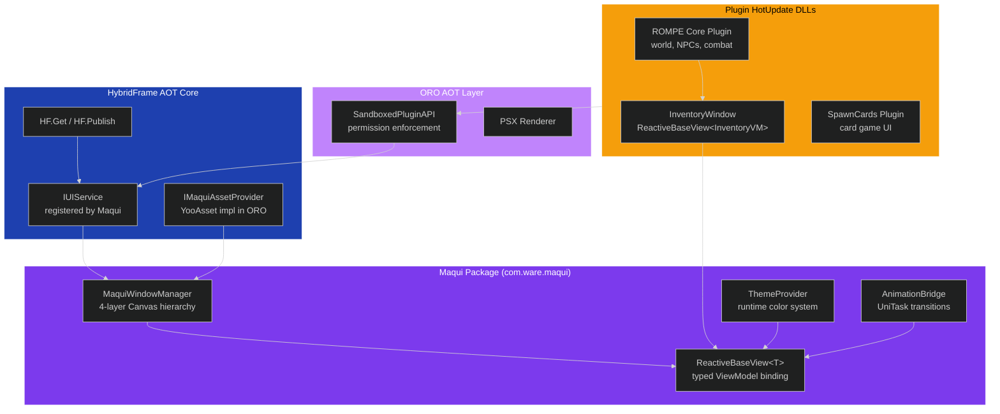
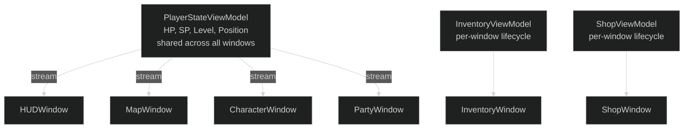
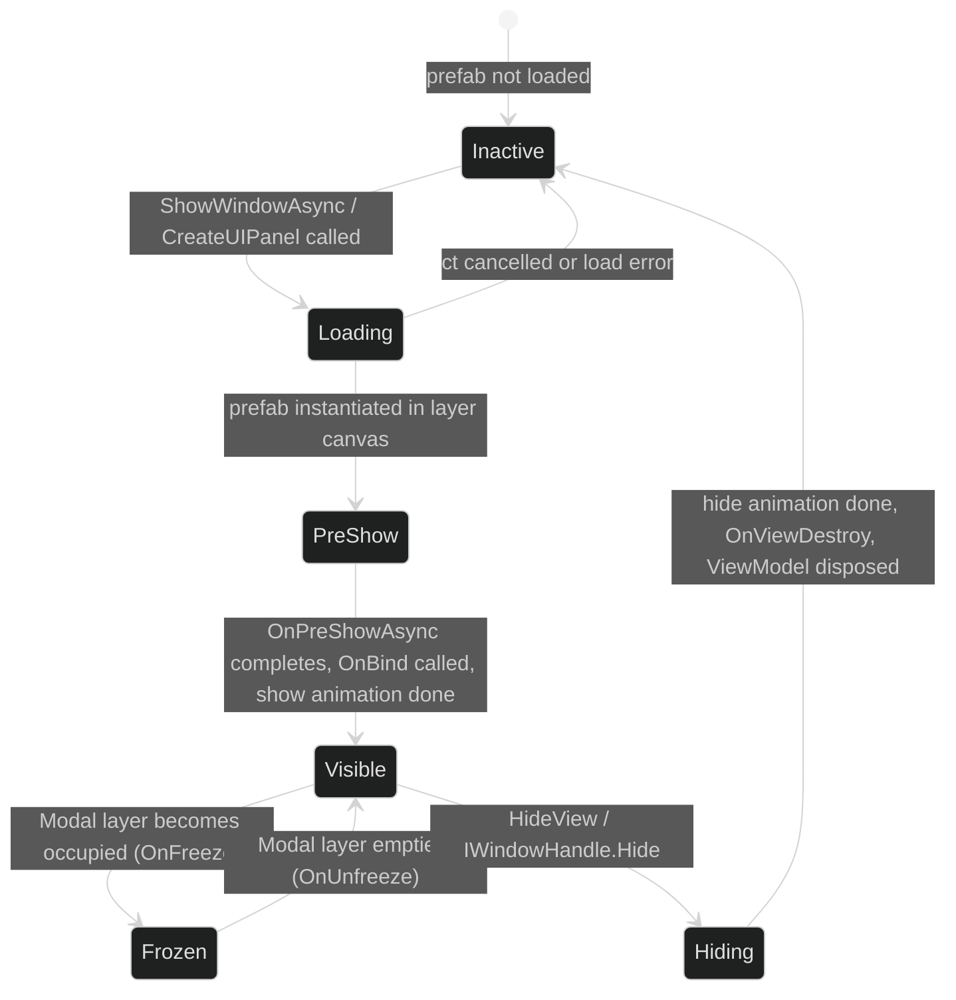
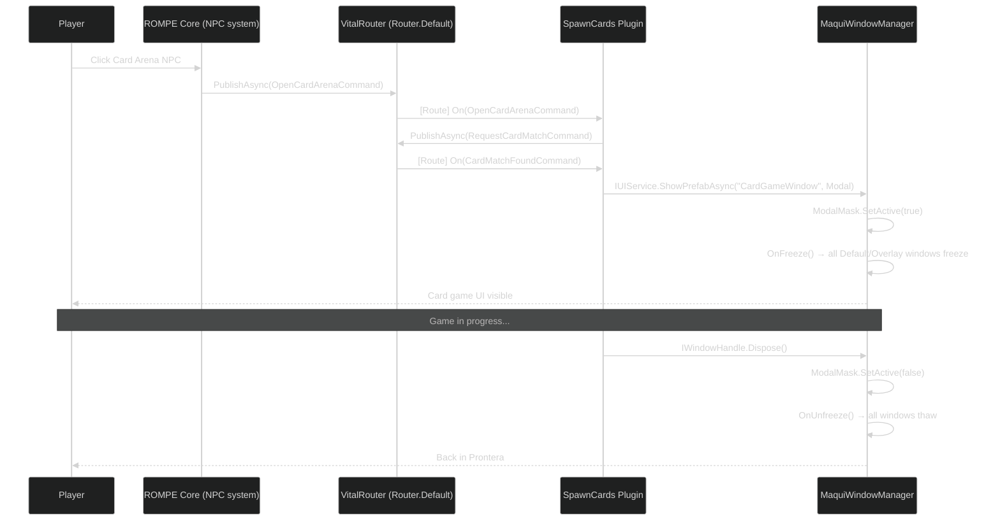

# ORO — UI System Design (Maqui Edition)

**Status:** Design (pending M1 implementation)
**Replaces:** OxGFrame UIBase/UIManager approach
**Workspace:** `G:\ro\RagnarokRebuildTcp` branch `rework`
**Maqui Package:** `com.ware.maqui` v0.1.0+ (self-contained — no OneUI or external UI framework dependency)

---

## System Overview

ORO's UI is built on **Maqui** — a MVVM UI framework using R3 reactive properties and VitalRouter commands. Every game window is a `ReactiveBaseView<T>` bound to a typed ViewModel. The window stack is managed by `MaquiWindowManager`, which separates windows into four rendering layers.



---

## 1. Rendering Layer Architecture

`MaquiWindowManager` creates four persistent child Canvases under the `Maqui_Core` DontDestroyOnLoad GameObject:

```
Maqui_Core [DontDestroyOnLoad]
└── MaquiWindowManager
    ├── Layer_Background  [Canvas sortOrder=0]     ← skybox overlays, ambient FX
    ├── Layer_Default     [Canvas sortOrder=100]   ← main panels: inventory, character, map
    ├── Layer_Overlay     [Canvas sortOrder=200]   ← HUD: HP bars, minimap, hotbar
    ├── Layer_ModalMask   [Canvas sortOrder=290]   ← semi-transparent black (auto-managed)
    └── Layer_Modal       [Canvas sortOrder=300]   ← dialogs, card game fullscreen, store
```

### Layer Usage

| UILayer | ORO Use Cases |
|:---|:---|
| `Background` | Ambient overlays, day/night sky UI, cutscene letterbox |
| `Default` | Inventory, character sheet, skills, quest log, NPC shop |
| `Overlay` | HUD (HP/SP bars, minimap, hotbar, buff icons, party frames) |
| `Modal` | Card game fullscreen, purchase confirmation, disconnect dialog, plugin store |

### Modal Mask

When any window is shown on `UILayer.Modal`:
1. `Layer_ModalMask` activates (semi-transparent black `Image`, `CanvasGroup.blocksRaycasts = true`)
2. All windows on `Default` and `Overlay` receive `OnFreeze()` — they disable their `GraphicRaycaster`
3. `UIFreezeChangedCommand { IsFrozen = true }` is published to VitalRouter

When the last Modal window is hidden: reverse, `OnUnfreeze()` fires, `UIFreezeChangedCommand { IsFrozen = false }`.

---

## 2. Game Window Base Pattern

All ORO game windows extend `ReactiveBaseView<T>` (which inherits from `MaquiBaseView`, Maqui's self-contained base class — no external dependency on OneUI or any other UI framework). The window handles its own show/hide via VitalRouter `[Route]` and performs its reactive binding in `OnBind()`.

### 2.1 Minimal Window

```csharp
// Shared.Contracts (visible to AOT and HotUpdate)
public readonly record struct OpenInventoryCommand : ICommand;
public readonly record struct CloseInventoryCommand : ICommand;

// com.rompe.core plugin (HotUpdate DLL)
[Routes(CommandOrdering.Sequential)]
public partial class InventoryWindow : ReactiveBaseView<InventoryViewModel>
{
    [Header("References")]
    [SerializeField] private RectTransform itemGrid;
    [SerializeField] private TMP_Text weightLabel;
    [SerializeField] private Button closeButton;

    // Called once — register with the Router for the lifetime of this GameObject
    private void Start()
    {
        this.MapTo(Router.Default).AddTo(destroyCancellationToken);
    }

    // --- VitalRouter intent subscription ---

    [Route]
    public async UniTask On(OpenInventoryCommand cmd, CancellationToken ct)
    {
        await AnimationBridge.Instance.FadeAsync(GetComponent<CanvasGroup>(), 1f, 0.2f, ct);
    }

    [Route]
    public void On(CloseInventoryCommand cmd) => HideView();

    // --- Maqui reactive binding ---

    protected override void OnBind()
    {
        ViewModel.Items
            .Subscribe(RefreshGrid)
            .AddTo(Disposables);

        ViewModel.CurrentWeight
            .CombineLatest(ViewModel.MaxWeight, (cur, max) => $"{cur}/{max} kg")
            .Subscribe(t => weightLabel.text = t)
            .AddTo(Disposables);

        closeButton.onClick
            .AsObservable()
            .Subscribe(_ => _ = Router.Default.PublishAsync(new CloseInventoryCommand()))
            .AddTo(Disposables);
    }

    private void RefreshGrid(IReadOnlyList<InventoryItem> items)
    {
        // Rebuild item grid from ViewModel data
    }
}
```

### 2.2 Window with Async Pre-fetch

```csharp
// CharacterWindow fetches server data before animating in
[Routes]
public partial class CharacterWindow : ReactiveBaseView<CharacterViewModel>
{
    private void Start() => this.MapTo(Router.Default).AddTo(destroyCancellationToken);

    [Route]
    public async UniTask On(OpenCharacterWindowCommand cmd, CancellationToken ct)
    {
        // Pre-fetch before revealing — called during OnPreShow phase
        await ViewModel.LoadCharacterDataAsync(ct);
        await AnimationBridge.Instance.ScaleAsync(
            GetComponent<RectTransform>(),
            Vector3.one,
            0.25f,
            ct: ct
        );
    }

    protected override void OnBind()
    {
        ViewModel.CharacterName
            .Subscribe(n => nameLabel.text = n)
            .AddTo(Disposables);

        ViewModel.BaseStats
            .Subscribe(RefreshStats)
            .AddTo(Disposables);
    }
}
```

### 2.3 Freeze-Aware Window (HUD)

Windows that must suppress input when a modal appears implement `OnFreeze`/`OnUnfreeze`:

```csharp
public partial class HUDWindow : ReactiveBaseView<HUDViewModel>
{
    [SerializeField] private CanvasGroup inputLayer;
    [SerializeField] private GraphicRaycaster raycaster;

    protected override void OnBind()
    {
        ViewModel.CurrentHP
            .Subscribe(hp => hpBar.value = hp / ViewModel.MaxHP.CurrentValue)
            .AddTo(Disposables);

        ViewModel.Buffs
            .Subscribe(RefreshBuffIcons)
            .AddTo(Disposables);
    }

    // Called by MaquiWindowManager when Modal layer becomes occupied
    protected override void OnFreeze()
    {
        inputLayer.interactable = false;
        raycaster.enabled = false;
    }

    protected override void OnUnfreeze()
    {
        inputLayer.interactable = true;
        raycaster.enabled = true;
    }
}
```

---

## 3. ViewModel Pattern

ViewModels are pure C# — no `UnityEngine` references. They own reactive state and business logic.

```csharp
// com.rompe.core plugin
public class InventoryViewModel : ViewModel
{
    // Reactive state
    public readonly ReactiveProperty<IReadOnlyList<InventoryItem>> Items = new(Array.Empty<InventoryItem>());
    public readonly ReactiveProperty<float> CurrentWeight = new(0f);
    public readonly ReactiveProperty<float> MaxWeight = new(50f);
    public readonly ReactiveProperty<InventoryItem> SelectedItem = new(null);

    private readonly IInventoryService _inventory;

    public InventoryViewModel(IInventoryService inventory)
    {
        _inventory = inventory;
    }

    public override void Initialize()
    {
        base.Initialize();
        // Server-side inventory updates arrive via the View's [Route] handler
        // or a shared service — ViewModels stay pure C# (no VitalRouter dependency)
    }

    public void ApplyServerUpdate(IReadOnlyList<InventoryItem> items, float weight)
    {
        Items.Value = items;
        CurrentWeight.Value = weight;
    }

    public void SelectItem(InventoryItem item) => SelectedItem.Value = item;

    public async UniTask UseItemAsync(InventoryItem item)
    {
        await HF.PublishAsync(new UseItemCommand { ItemId = item.Id });
    }
}
```

### Shared vs Per-Window ViewModels



**Rule:** `PlayerStateViewModel` (HP, SP, level, position) is created once by `RompeCorePlugin.OnLoad()` and registered as a service. Windows that need it call `HF.Get<PlayerStateViewModel>()`. Per-window ViewModels (`InventoryViewModel`, `ShopViewModel`) are created fresh when the window opens and disposed when it closes.

---

## 4. Plugin Window Creation

### 4.1 First-Party (ROMPE Core) — Typed API

```csharp
// In RompeCorePlugin.OnLoad():
var inventoryVm = new InventoryViewModel(api.GetService<IInventoryService>());

var handle = await HF.Get<IUIService>().ShowWindowAsync<InventoryWindow, InventoryViewModel>(
    "com.rompe.core/InventoryWindow",   // YooAsset key (scoped to plugin's bundle)
    UILayer.Default,
    inventoryVm,                        // pre-constructed VM with injected services
    ct
);

// ShowWindowAsync returns null on error (missing prefab, missing component, load failure)
// Always null-check before storing:
if (handle == null)
{
    Debug.LogWarning("Failed to open inventory window");
    return;
}

_inventoryHandle = handle;
```

### 4.2 Community Plugin — Prefab API

```csharp
// In a community plugin's OnLoad():
public async UniTask ShowGuildPanelAsync(IPluginAPI api, CancellationToken ct)
{
    // api.CreateUIPanel wraps IUIService.ShowPrefabAsync with permission check + asset scoping
    var panelRoot = await api.CreateUIPanelAsync("GuildPanel", UILayer.Default, ct);
    // panelRoot is a RectTransform in Layer_Default
    // Plugin owns this RectTransform — destroyed on plugin unload
}
```

### 4.3 SpawnCards — Modal Fullscreen

```csharp
// SpawnCards plugin: fullscreen card game UI over ROMPE world
[Routes]
public partial class CardGamePlugin : IPluginEntryPoint
{
    private IWindowHandle _cardGameHandle;

    public void OnLoad(IPluginAPI api)
    {
        api.Subscribe<CardMatchFoundCommand>(async (cmd, ct) =>
        {
            // Load the card game window prefab from SpawnCards' YooAsset bundle
            _cardGameHandle = await HF.Get<IUIService>().ShowPrefabAsync(
                "SpawnCards/CardGameWindow",
                UILayer.Modal,
                pluginId: Manifest.Id,
                ct: ct
            );

            // HUD freezes automatically (MaquiWindowManager → OnFreeze)
            // ModalMask activates automatically
        });

        api.Subscribe<CardMatchEndedCommand>((cmd, ct) =>
        {
            _cardGameHandle?.Hide();
            _cardGameHandle?.Dispose();
            _cardGameHandle = null;
            // HUD unfreezes automatically (MaquiWindowManager → OnUnfreeze)
            return UniTask.CompletedTask;
        });
    }

    public void OnUnload()
    {
        // IUIService.CleanupPlugin() destroys all panels owned by this plugin
        HF.Get<IUIService>().CleanupPlugin(Manifest.Id);
    }
}
```

---

## 5. Window Lifecycle



### Lifecycle Method Call Sequence

| Phase | Method | Who Calls It |
|:---|:---|:---|
| Instantiated | `OnViewAwake()` / `Awake()` | Unity |
| Pre-show | `OnPreShowAsync(ct)` | `MaquiWindowManager` |
| Show animation | AnimationBridge.FadeAsync / ScaleAsync | Developer in `[Route]` handler |
| Binding | `Initialize(viewModel)` → `OnBind()` | `MaquiWindowManager` / developer |
| Active | VitalRouter `[Route]` handlers fire | VitalRouter |
| Freeze | `OnFreeze()` | `MaquiWindowManager` |
| Unfreeze | `OnUnfreeze()` | `MaquiWindowManager` |
| Pre-hide | `OnPreHide()` | Developer (override if needed) |
| Hide animation | AnimationBridge | Developer in `[Route]` handler |
| Destroy | `OnViewDestroy()` | `MaquiWindowManager` / Unity |

---

## 6. Asset Loading

Windows are loaded from YooAsset bundles via `IMaquiAssetProvider`. ORO registers its implementation during the HFLauncher boot sequence, before any window opens.

```csharp
// ORO boot procedure (HotUpdate, runs after LoadDllProcedure):
public class OROBootProcedure : IHFProcedure
{
    public async UniTask RunAsync(CancellationToken ct)
    {
        // Register YooAsset provider so Maqui uses it for window loading
        MaquiAssetProviderBridge.SetProvider(new YooAssetMaquiProvider());

        // Register IUIService with HF (MaquiWindowManager created by CoreBootstrap already)
        // HF.Get<IUIService>() is already available from Maqui's CoreBootstrap
        // Just confirm it's registered:
        Debug.Assert(HF.TryGet<IUIService>(out _), "Maqui IUIService not registered");
    }
}

// YooAsset provider implementation (ORO layer, not Maqui):
public class YooAssetMaquiProvider : IMaquiAssetProvider
{
    public async UniTask<GameObject> LoadPrefabAsync(string key, CancellationToken ct)
    {
        var handle = YooAssets.LoadAssetAsync<GameObject>(key);
        await handle.ToUniTask(cancellationToken: ct);
        return handle.AssetObject as GameObject;
    }

    public void ReleasePrefab(string key)
    {
        YooAssets.UnloadUnusedAssets();
    }
}
```

---

## 7. Theme Integration

ORO windows participate in the Maqui theme system automatically.

**Static theming** — attach `ThemeImageSubscriber` / `ThemeTextSubscriber` to view components in the prefab. Slot `ColorType` in the Inspector. No code required.

**Dynamic theming** — react to theme changes in `OnBind()`:

```csharp
protected override void OnBind()
{
    // React to live theme changes
    ThemeProvider.Instance.CurrentTheme
        .Subscribe(theme =>
        {
            panelBackground.color = theme.BackgroundContrast;
            titleText.color = theme.TextPrimary;

            // PSX aesthetic: update shader properties
            pixelatedMaterial.SetColor("_TintColor", theme.Primary);
        })
        .AddTo(Disposables);
}
```

**Plugin-specific theming** — SpawnCards ships its own `ThemeData` assets. During `OnLoad`, the plugin:

```csharp
api.Subscribe<CardGameStartedCommand>((cmd, ct) =>
{
    var cardTheme = Resources.Load<ThemeData>("SpawnCards/Theme_CardGame");
    ThemeProvider.Instance.SetTheme(cardTheme);
    return UniTask.CompletedTask;
});

api.Subscribe<CardGameEndedCommand>((cmd, ct) =>
{
    // Restore ROMPE world theme
    var worldTheme = HF.Get<IThemeService>().DefaultTheme;
    ThemeProvider.Instance.SetTheme(worldTheme);
    return UniTask.CompletedTask;
});
```

---

## 8. Cross-Plugin UI Communication

Plugins communicate UI intent through VitalRouter commands, never through direct window references.



**Rule:** Never call `window.Show()` from plugin B on a window belonging to plugin A. Use a command:

```csharp
// ❌ Cross-plugin direct reference (violates sandbox)
var inv = GameObject.FindObjectOfType<InventoryWindow>();
inv.Show();

// ✅ Via VitalRouter (sandboxed, testable)
await api.PublishAsync(new OpenInventoryCommand());
```

---

## 9. ORO-Specific Window Conventions

### Naming

| Type | Convention | Example |
|:---|:---|:---|
| Window class | `{Feature}Window` | `InventoryWindow`, `ShopWindow` |
| ViewModel class | `{Feature}ViewModel` | `InventoryViewModel`, `ShopViewModel` |
| Open command | `Open{Feature}Command` | `OpenInventoryCommand` |
| Close command | `Close{Feature}Command` | `CloseInventoryCommand` |
| Prefab path (YooAsset key) | `{PluginId}/{WindowName}` | `com.rompe.core/InventoryWindow` |

### Layer assignment

| Window | Layer |
|:---|:---|
| HUD (HP/SP bars, minimap, hotbar) | `Overlay` |
| Main panels (inventory, character, map, quest log) | `Default` |
| NPC dialog | `Default` |
| Item tooltip | `Overlay` |
| Confirmation dialog ("Use Butterfly Wing?") | `Modal` |
| SpawnCards game UI | `Modal` |
| Plugin Store browser | `Modal` |
| Boot/patch progress | `Modal` |
| Day/night sky overlays | `Background` |

### Window show/hide discipline

```csharp
// ✅ Show: always via command or IUIService — never directly from another window
// Note: returns null on error (asset not found, component missing, etc.)
var handle = await HF.Get<IUIService>().ShowWindowAsync<InventoryWindow, InventoryViewModel>(
    "com.rompe.core/InventoryWindow", UILayer.Default, inventoryVm, ct);
if (handle == null) return; // handle error gracefully

// ✅ Hide: IWindowHandle.Dispose() or CloseCommand
_handle?.Dispose();

// ❌ Never
GetComponent<CanvasGroup>().alpha = 0; // bypasses lifecycle hooks and freeze state
```

---

## 10. Migration from OxGFrame UIBase

For any existing OxGFrame UIBase window in the ORO rework branch:

| OxGFrame | Maqui Equivalent |
|:---|:---|
| `class MyWindow : UIBase` | `class MyWindow : ReactiveBaseView<MyViewModel>` |
| `OnCreate()` | `OnViewAwake()` (no change, Unity Awake) |
| `OnPreShow()` | `OnPreShowAsync(CancellationToken)` — async version |
| `OnShow()` | `OnBind()` — reactive subscriptions here |
| `OnUpdate(float dt)` | No equivalent — use R3 `Observable.EveryUpdate()` if needed |
| `OnHide()` | `OnPreHide()` or hide logic in `[Route]` handler |
| `OnClose()` | `OnViewDestroy()` — dispose `Disposables` here |
| `Freeze()` | `OnFreeze()` — called automatically by MaquiWindowManager |
| `UnFreeze()` | `OnUnfreeze()` — called automatically |
| `UIManager.OpenAsync<T>()` | `HF.Get<IUIService>().ShowWindowAsync<T, TVM>(assetKey, layer)` |
| `UIManager.CloseAsync<T>()` | `handle.Dispose()` or `CloseWindowCommand` |
| NodeType.MainUI | `UILayer.Default` |
| NodeType.PopupUI | `UILayer.Default` |
| NodeType.HUD | `UILayer.Overlay` |
| NodeType.GlobalUI | `UILayer.Overlay` |
| NodeType.Modal | `UILayer.Modal` |
| `UIFreezeManager.Freeze()` | `UIFreezeChangedCommand` + `OnFreeze()` hooks (auto-managed) |
| `UIMaskManager` | `ModalMask` canvas layer (auto-managed) |
| `GetView<T>()` | Not needed — communicate via VitalRouter commands |
| Bind data in `OnShow()` | `protected override void OnBind()` with R3 subscriptions |

### Step-by-step migration of a single window

1. Change base class: `UIBase` → `ReactiveBaseView<TViewModel>`
2. Create a `TViewModel` class extending `ViewModel`; move state fields into it as `ReactiveProperty<T>`
3. Move `OnShow()` body into `OnBind()` — replace imperative updates with `.Subscribe()` calls
4. Replace `OnClose()` with `OnViewDestroy()` — call `base.OnViewDestroy()` first
5. Replace `UIManager.OpenAsync<T>()` calls with a `Open{Feature}Command` and a `[Route]` handler
6. Delete any `GetView<T>()` cross-window references; replace with commands
7. Add `[Routes]` attribute and make class `partial` if using VitalRouter subscriptions
8. Set `UILayer` assignment in `IUIService.ShowWindowAsync` call

---

## 11. Lessons from Demo Implementation

Three demo scenes were built against Maqui v0.1.0 using real third-party UI kits (Modular Game UI Kit, Le Tai TranslucentImage). DevsDaddy OneUI was used in the sandbox only and is **not** a dependency of Maqui.Runtime. These are the hard-won lessons.

### 11.1 Starter Pattern — One MonoBehaviour Owns All Handles

Each demo uses a single `[Routes] partial class DemoStarter : MonoBehaviour` that:
- Creates ViewModels
- Calls `MaquiWindowManager.Instance.ShowWindowAsync(...)` for each window
- Holds all `IWindowHandle` references
- Routes open/close commands via `[Route]` handlers
- Disposes everything in `OnDestroy()`

This proved to be the cleanest pattern. **Don't let windows open other windows directly** — route through the starter.

```csharp
[Routes]
public partial class Demo2Starter : MonoBehaviour
{
    private HUDViewModel  _hudVm;
    private IWindowHandle _hudHandle;
    private IWindowHandle _inventoryHandle;
    private IWindowHandle _shopHandle;

    private async void Start()
    {
        this.MapTo(Router.Default).AddTo(destroyCancellationToken);

        _hudVm = new HUDViewModel();
        _hudHandle = await MaquiWindowManager.Instance.ShowWindowAsync<HUDView, HUDViewModel>(
            "Views/Demo2_HUD", UILayer.Overlay, _hudVm, destroyCancellationToken);
    }

    [Route]
    public async UniTask On(OpenInventoryCommand _, CancellationToken ct)
    {
        if (_inventoryHandle != null) return; // guard double-open
        var vm = new InventoryViewModel();
        _inventoryHandle = await MaquiWindowManager.Instance
            .ShowWindowAsync<InventoryView, InventoryViewModel>(
                "Views/Demo2_Inventory", UILayer.Default, vm, ct);
    }

    [Route]
    public void On(CloseInventoryCommand _)
    {
        _inventoryHandle?.Dispose();
        _inventoryHandle = null;     // always null after dispose
    }

    private void OnDestroy()
    {
        _shopHandle?.Dispose();
        _inventoryHandle?.Dispose();
        _hudHandle?.Dispose();
    }
}
```

### 11.2 Shared ViewModel for Cross-Window Sync

Demo 3 uses one `FrostedHUDViewModel` shared across three windows (HUD, Notifications, Settings). When the notification list marks items as read, the HUD badge count updates instantly because they subscribe to the same `ReactiveProperty`.

```csharp
// Starter creates one VM, passes it to all three windows
_sharedVm = new FrostedHUDViewModel();

_hudHandle = await MaquiWindowManager.Instance.ShowWindowAsync<FrostedHUDView, FrostedHUDViewModel>(
    "Views/Demo3_FrostedHUD", UILayer.Overlay, _sharedVm, ct);

// Later, same VM instance goes to the notification modal
_notifHandle = await MaquiWindowManager.Instance.ShowWindowAsync<NotificationView, FrostedHUDViewModel>(
    "Views/Demo3_Notifications", UILayer.Modal, _sharedVm, ct);
```

**Rule for ORO:** `PlayerStateViewModel` (HP/SP/level) should follow this pattern — one instance, shared across HUD, character, party, and map windows. Per-window VMs (inventory, shop) get created fresh per open.

### 11.3 Command Structs — Keep Them Simple

`readonly record struct` with `ICommand` works well. Use data fields only when the receiver needs context (e.g., `ItemPurchasedCommand` carries `ItemName` and `Cost`). Most commands are empty signals.

```csharp
// Signal commands — no data needed
public readonly record struct OpenInventoryCommand : ICommand;
public readonly record struct CloseInventoryCommand : ICommand;

// Data command — receiver needs the payload
public readonly record struct ItemPurchasedCommand(string ItemName, int Cost) : ICommand;
```

### 11.4 VitalRouter Wiring — MapTo, Not Subscribe

VitalRouter 2.x uses `this.MapTo(Router.Default).AddTo(destroyCancellationToken)` for `[Route]` wiring. The older `Router.Default.Subscribe(this)` pattern does not exist. `PublishAsync` returns `ValueTask` — use `_ = Router.Default.PublishAsync(...)` for fire-and-forget.

```csharp
// In Start() — both views and starters
private void Start() => this.MapTo(Router.Default).AddTo(destroyCancellationToken);

// Fire-and-forget publish from button click
_inventoryButton.onClick.AddListener(() =>
    _ = Router.Default.PublishAsync(new OpenInventoryCommand()));
```

### 11.5 OnBind — Subscribe Only, Never Read .Value

R3 `ReactiveProperty.Subscribe()` emits the current value immediately. No need to read `.Value` for initial setup — the subscription handles it.

```csharp
protected override void OnBind()
{
    // ✅ Subscribe — fires immediately with current value, then on every change
    ViewModel.Gold
        .Subscribe(g => _goldText.text = g.ToString("N0") + " g")
        .AddTo(Disposables);

    // ❌ Don't do this — redundant
    _goldText.text = ViewModel.Gold.Value.ToString("N0") + " g";
    ViewModel.Gold.Subscribe(g => _goldText.text = g.ToString("N0") + " g").AddTo(Disposables);
}
```

### 11.6 OnFreeze / OnUnfreeze — Real Use Case

Modal freeze works automatically via `MaquiWindowManager`. Views only need to override these for custom per-view behavior (dim buttons, mute audio, etc.).

```csharp
protected override void OnFreeze()
{
    _inventoryButton.interactable = false;  // grey out when modal is up
}

protected override void OnUnfreeze()
{
    _inventoryButton.interactable = true;
}
```

### 11.7 OnPreShowAsync — Parallel Fade + Scale

Views can override `OnPreShowAsync` for intro animations. Use `UniTask.WhenAll` to run fade and scale in parallel.

```csharp
protected override async UniTask OnPreShowAsync(CancellationToken ct)
{
    _canvasGroup.alpha = 0f;
    _panelRect.localScale = new Vector3(0.92f, 0.92f, 1f);

    await UniTask.WhenAll(
        AnimationBridge.Instance.FadeAsync(_canvasGroup, 1f, 0.28f, ct),
        AnimationBridge.Instance.ScaleAsync(_panelRect, Vector3.one, 0.28f,
            AnimationCurve.EaseInOut(0f, 0f, 1f, 1f), ct)
    );
}
```

### 11.8 Input System Compatibility

Unity projects using the new Input System package throw `InvalidOperationException` when `UnityEngine.Input` (legacy) is accessed. Two fixes were required:

1. **EventSystem**: Replace `StandaloneInputModule` with `InputSystemUIInputModule` in every scene. Use reflection to avoid hard assembly references:
```csharp
var inputModuleType = System.Type.GetType(
    "UnityEngine.InputSystem.UI.InputSystemUIInputModule, Unity.InputSystem");
if (inputModuleType != null && es.GetComponent(inputModuleType) == null)
    es.gameObject.AddComponent(inputModuleType);
```

2. **InputBridge**: Wrap legacy `Input.*` calls in try/catch so `LegacyInputProvider` degrades gracefully instead of crashing:
```csharp
public float GetAxis(string axisName)
{
    try { return Input.GetAxis(axisName); }
    catch (System.InvalidOperationException) { return 0f; }
}
```

**Recommendation for ORO:** Register a proper `NewInputSystemProvider : IInputProvider` at boot instead of relying on the legacy fallback.

### 11.9 Screen Space Overlay vs Camera — Layering Pitfall

`MaquiWindowManager` creates Screen Space **Overlay** canvases. These **always render on top** of Screen Space Camera canvases. When overlaying Maqui windows on top of a scene that uses Screen Space Camera (e.g., a 3D game world with existing UI), the Maqui HUD will render above the scene's own canvases regardless of sort order.

**This is correct for ORO** — Maqui UI should be the topmost layer. But if a demo scene has its own Camera-based UI you want to see underneath, be aware of this behavior.

### 11.10 Scene Setup — Disable, Don't Delete

When integrating with existing scenes from third-party kits, the right approach is:
- **Disable** the original demo controller scripts (`mb.enabled = false`)
- **Keep** all visual components (canvases, images, text, 3D objects) intact
- **Skip** your own namespace when disabling (`if (ns.StartsWith("MaquiDemos")) continue`)
- **Fix** EventSystem input modules per §11.8
- **Add** a MaquiBootstrap GameObject with your Starter component

```csharp
// Disable third-party demo scripts, keep visuals
foreach (var mb in root.GetComponentsInChildren<MonoBehaviour>(true))
{
    if (mb == null) continue;
    string ns = mb.GetType().Namespace ?? "";
    if (ns.StartsWith("MaquiDemos")) continue; // don't disable our own
    string t = mb.GetType().FullName ?? "";
    if (t.Contains("Demo") || t.Contains("Game.Controller"))
        mb.enabled = false;
}
```

### 11.11 DontDestroyOnLoad — Invisible to Scene Queries

All Maqui canvases and instantiated windows live in the `DontDestroyOnLoad` scene (created by `CoreBootstrap`). They are **not findable** by `FindObjectOfType`, scene hierarchy queries, or MCP `find_gameobjects`. Debug by checking console logs — if `MaquiWindowManager.Instance` were null, a `NullReferenceException` would appear.

### 11.12 Dispose Guard Pattern

Always null-check and null-out `IWindowHandle` after dispose. Double-dispose causes errors.

```csharp
[Route]
public void On(CloseShopCommand _)
{
    _shopHandle?.Dispose();
    _shopHandle = null;  // prevent double-dispose
}
```

### 11.13 What the Demos Got Wrong (TODO)

The current demos create new prefabs that overlay on top of existing scene UI. The correct approach is to **rewire existing UI elements** in each scene to use Maqui's MVVM binding — keeping the original visual hierarchy intact and driving it with ViewModels and reactive subscriptions. See `docs/demos-todo.md` for the full plan.
