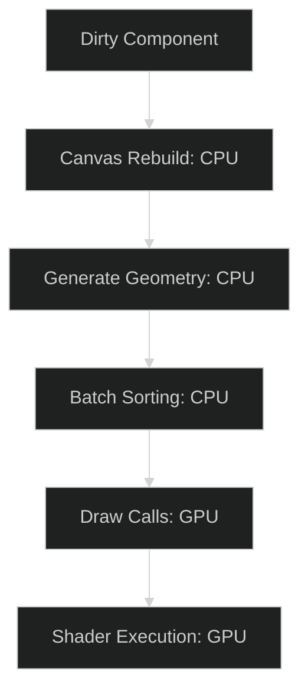

# Rendering Optimization Audit

Performance is a cornerstone of the **OneUI** DX. This audit provides a framework for identifying and resolving rendering bottlenecks in both uGUI and the upcoming UI Toolkit integration.

---

## 1. The Performance Pipeline

Every UI element impacts the three main performance pillars: **CPU (Layout/Rebuild)**, **GPU (Draw Calls/Fill Rate)**, and **Memory (Sprites/Materials)**.

---

## 2. Common Bottlenecks & Resolutions

### The "Canvas Rebuild" Storm
- **Issue**: Moving a single icon causes the entire UI hierarchy to recalculate its triangles.
- **Resolution**: Use **Sub-Canvases**. Isolate elements that animate frequently (e.g., Progress Bars, Hover Effects) onto their own Canvas components.

### Draw Call Fragmentation
- **Issue**: Too many unique textures and material instances prevent Unity's dynamic batching.
- **Resolution**:
  - Use **Sprite Atlases** for all UI icons.
  - Implement a **Shared Material Pool** for procedural effects like `Gradient.cs`.

### Fill Rate (Overdraw)
- **Issue**: Large invisible images or stacked semi-transparent layers waste GPU cycles.
- **Resolution**:
  - Disable `Raycast Target` and `Image` components on "Container" objects.
  - Use the **Unity Overdraw Tool** (Scene View) to identify "Hot Zones" (dark red areas).

---

## 3. Profiling Checklist

| Tool                  | Focus Area              | Goal                               |
| :-------------------- | :---------------------- | :--------------------------------- |
| **Unity UI Profiler** | Batch Breaks / Rebuilds | < 5ms CPU per frame                |
| **Frame Debugger**    | Draw Call Sequence      | < 20 Draw Calls per Scene          |
| **Material Audit**    | Instance count          | No `Material (Instance)` in memory |

---

## 4. Best Practices for Developers

1. **Pixel Perfect**: Only enable `Pixel Perfect` on the main root Canvas if absolutely necessary, as it adds CPU overhead to every layout change.
2. **Text Clipping**: Use the `Rect Mask 2D` instead of a standard `Mask` for scroll views. It is significantly more efficient because it handles clipping in the shader rather than using a Stencil Buffer.
3. **Static UI**: For UI that never changes (e.g., Background Borders), disable the `Canvas` component or the `Graphic` component entirely while hidden.

> [!CAUTION]
> Avoid modifying `RectTransform.anchoredPosition` every frame from C#. Use **Shaders** or **Animators** to handle continuous motion to keep the CPU "Main Thread" free for game logic.
