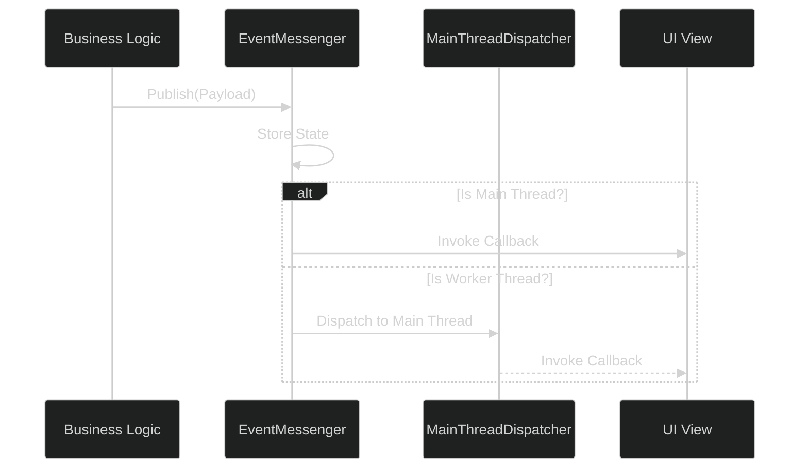

# DevsDaddy.OneUI: Deep Technical Analysis

> [!NOTE]
> For a comparison with other systems, see the [UI Architecture Strategy](ui-systems-comparison.md).

## System Role & Context
**DevsDaddy.OneUI** is a robust, framework-first UI system designed for Unity applications that scale. It moves away from the "drag-and-drop" prefab mess by enforcing a strict **Model-View-Controller (MVC)** inspired pattern, centered around a global event bus and a static framework container.

---

## 1. Core Architecture: The Static Backbone

The system's intelligence resides in the `UIFramework` static class, which acts as a service locator and mediator for all UI-related tasks.

### Centralized View Management
The framework maintains a registry of all active views, allowing any script in the project to access a view without direct scene references.

```csharp
// Example: Accessing a view from anywhere
var moreMenu = UIFramework.GetView<MoreMenuView>();
moreMenu.ShowView(new DisplayOptions { IsAnimated = true });
```

### Resource-Driven Instantiation
OneUI encourages late-binding through Unity's `Resources` system. This reduces memory pressure by only loading the UI elements needed for the current context.

```csharp
public static void LoadViewFromResources<T>(string resourcePath, bool isHomeView = false) {
    GameObject loadedObject = Resources.Load<GameObject>(resourcePath);
    // ... component validation and binding logic ...
}
```

---

## 2. The Communication Layer: EventMessenger

OneUI features a sophisticated, thread-safe event bus implementation in [EventMessenger.cs](file:///d:/ware/CharqUI/Assets/UI/OneUI/Shared/EventFramework/EventMessenger.cs).

### Messaging Mechanics
- **Implicit State Management**: The messenger stores the last published payload of each type, allowing new subscribers to "catch up" on the current state via `GetState<T>()`.
- **Thread Safety**: It utilizes a `MainThreadDispatcher` to ensure that even if events are published from background threads (e.g., network callbacks), the UI updates always happen on Unity's main thread.
- **Predicated Subscriptions**: Subscribers can filter events before they reach the handler.





## 3. View Lifecycle & Transition Engine

Every UI screen inherits from `BaseView`, which implements `IBaseView`. This standardization ensures that all screens behave predictably regarding animations and input blocking.

### The Animation Coroutine
Unlike systems that rely on the Animator window, OneUI performs procedural lerping for maximum control and performance in simple transitions.

```csharp
private IEnumerator AnimateView(bool visible, Action onComplete = null) {
    // Setup initial states (Canvas enabled, alpha, scale)
    // Delay handling
    float elapsedTime = 0f;
    while (elapsedTime < m_CurrentDisplayOptions.Duration) {
        elapsedTime += Time.deltaTime;
        // Lerp Alpha or Scale based on AnimationType
        yield return null;
    }
    // Finalize visibility / Input blocking
    onComplete?.Invoke();
}
```

### Lifecycle Hooks
| Hook            | Description                                                 |
| :-------------- | :---------------------------------------------------------- |
| `OnViewAwake`   | Component initialization and event binding.                 |
| `OnViewStart`   | Initial visibility logic and data fetching.                 |
| `OnViewDestroy` | Cleanup and event unsubscription.                           |
| `OnDataUpdated` | Triggered when a payload of the relevant type is published. |

---

## 4. Conflict & Resolution: Decoupling Strategy

**The Problem**: In standard Unity UI development, views often become "God Objects" that know too much about the game state.

**OneUI's Solution**: 
1. **Payloads as Contracts**: Views only know about `IPayload` objects.
2. **Generic Binding**: `UIFramework.BindView<T>` handles the registration without the view needing to know who its manager is.
3. **Static Wrappers**: By using `GetWrapper()`, even non-MonoBehaviour classes can participate in the UI's time-sliced operations.

---

## Technical Features List
- **Static API Surface**: Global access without singleton boilerplate in every view.
- **Thread-Bridging**: Seamless execution of UI logic from asynchronous tasks.
- **Procedural Animations**: Lightweight Scale/Fade transitions without Animator overhead.
- **Navigation History**: Stack-based "Go Back" logic built into the core.
- **Smart Resource Loading**: Decouples UI prefabs from specific scenes for better asset management.
- **Subscription Predicates**: Fine-grained control over which events a view reacts to.
