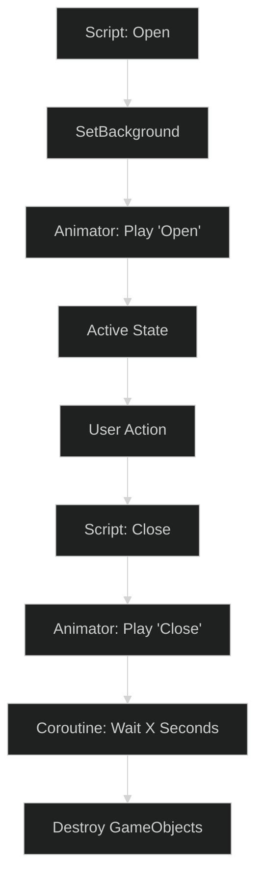

# Modular Game UI Kit: Deep Technical Analysis

> [!NOTE]
> For a comparison with other systems, see the [UI Architecture Strategy](ui-systems-comparison.md).

## System Role & Context
The **Modular Game UI Kit** is a utility-centric production library. It eschews complex architectural patterns in favor of high-quality, reusable components that leverage Unity's built-in systems (Animator, uGUI, and Mesh Effects). It is designed for developers who need to iterate rapidly on visual design without building a custom framework from scratch.

---

## 1. Core Mechanics: Procedural & Mesh-Based Visuals

A standout feature of this kit is its use of procedural generation to reduce texture memory and improve visual flexibility.

### Procedural Overlays
The [Popup.cs](file:///d:/ware/CharqUI/Assets/UI/Pack/Common/Scripts/Popup.cs) script demonstrates a clever approach to blocking input. Instead of shipping a massive "dimmed background" sprite, it generates a 1x1 texture at runtime.

```csharp
private void AddBackground() {
    var bgTex = new Texture2D(1, 1);
    bgTex.SetPixel(0, 0, backgroundColor);
    bgTex.Apply();
    // ... setup RawImage/Image with this texture ...
    image.canvasRenderer.SetAlpha(0.0f);
    image.CrossFadeAlpha(1.0f, 0.4f, false);
}
```

### Vertex-Level Mesh Effects
The [Gradient.cs](file:///d:/ware/CharqUI/Assets/UI/Pack/Common/Scripts/Gradient.cs) tool inherits from `BaseMeshEffect`. This allows it to modify the vertex colors of any uGUI element in real-time without requiring a custom shader for every UI element.

```csharp
public override void ModifyMesh(VertexHelper vh) {
    // ... matrix calculation based on Angle ...
    for (var i = 0; i < vh.currentVertCount; i++) {
        vh.PopulateUIVertex(ref vertex, i);
        var localPosition = localPositionMatrix * vertex.position;
        vertex.color *= Color.Lerp(Color2, Color1, localPosition.y);
        vh.SetUIVertex(vertex, i);
    }
}
```

---

## 2. Navigation & Workflow: Prefab-Centric

The kit relies heavily on Unity's `Animator` for state management, making it highly "Designer Friendly."

### Animator-Based Lifecycle
Popups and transitions use Animator parameters (e.g., "Open", "Close") to drive their lifecycle. This allows designers to add particle effects or audio cues directly into the animation timeline.




### Component Interaction (The Tab System)
The [TabMenu.cs](file:///d:/ware/CharqUI/Assets/UI/Pack/Common/Scripts/TabMenu.cs) script manages complexity by instantiating content on-demand.

```csharp
public void SetToggleEnabled(int index, bool value) {
    // Swap Tab Visuals (On/Off groups)
    if (value) {
        if (currentGroup != null) Destroy(currentGroup);
        // Clean instantiation of specified content prefab
        currentGroup = Instantiate(Content[index], Root, false);
    }
}
```

---

## 3. Comparative Advantage: The "Plugin" Mindset

**Why use this kit?**
- **Zero Boilerplate**: You don't need a `UIFramework` or `Messenger` to use a button from this kit.
- **Low Memory Footprint**: Heavy use of procedural backgrounds and mesh colors means fewer unique textures.
- **Animator Integration**: Easy to synchronize UI state with Unity's internal systems.

---

## 4. Technical Debt & Constraints

- **Component Sprawl**: Because each component is independent, there is no centralized way to "Close All Windows" without writing a custom manager.
- **Overhead**: Relying on `Instantiate` and `Destroy` for tab switching can cause frame drops if the content is complex.
- **Direct References**: Scripts often require direct references in the Inspector, which can lead to "Missing Reference" errors during heavy refactoring.

---

## Technical Features List
- **Procedural Texture Generation**: Dynamic creation of overlays and backgrounds.
- **Mesh-Color Gradients**: Runtime gradient evaluation without custom shaders.
- **Animator-Driven Transitions**: Standard Unity workflow for UI motion.
- **Late-Binding Content**: Tab systems that only load necessary prefabs.
- **Cross-Scene Faders**: Easy implementation of "Black Fade" scene transitions.
- **Modular Info Objects**: Components like `ButtonInfo` that decouple button metadata from the logic.
