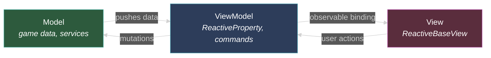
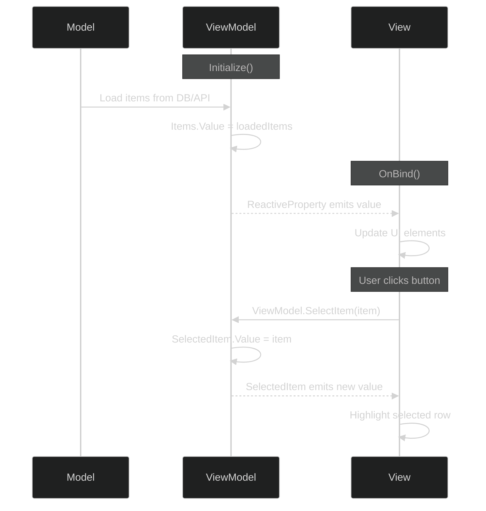
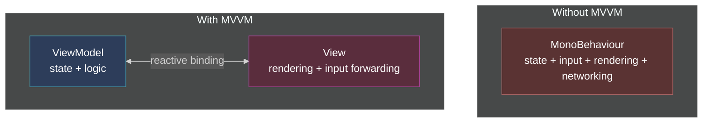
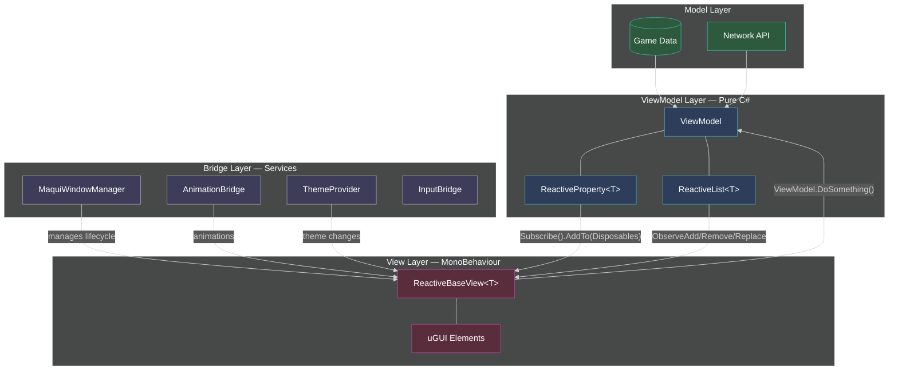
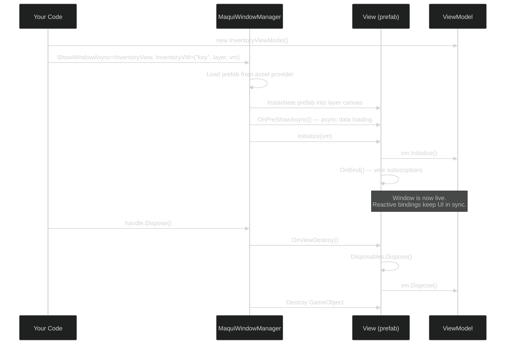

# Why Maqui Is MVVM

Maqui is a **Model-View-ViewModel** UI framework for Unity. This document explains how each MVVM layer maps to Maqui's architecture and why it matters.

---

## The Short Version

| MVVM Layer | Maqui Class | Responsibility |
|:--|:--|:--|
| **Model** | Your game data (C# POCOs, services, APIs) | Truth — inventory DB, player stats, server state |
| **ViewModel** | `ViewModel` + `ReactiveProperty<T>` | Exposes Model data as observable state, handles user intent |
| **View** | `ReactiveBaseView<T>` | Subscribes to ViewModel, renders UI, forwards input back |

The ViewModel never knows the View exists. The View never touches the Model directly. Data flows in one direction through reactive bindings.



---

## Layer by Layer

### Model — Your Data

The Model is whatever your game already has: database records, network responses, ScriptableObjects, save files. Maqui doesn't define or constrain the Model layer. It just expects the ViewModel to translate it.

```csharp
// This is your game code, not Maqui
public class InventoryItem
{
    public string Id { get; set; }
    public string Name { get; set; }
    public int PowerLevel { get; set; }
}
```

### ViewModel — Observable State

A ViewModel extends `Maqui.Core.Logic.ViewModel`. It holds **reactive properties** that the View will subscribe to, and **methods** that represent user intent.

Key rules:
- No `using UnityEngine` — pure C#, fully testable without Unity
- State lives in `ReactiveProperty<T>` (single values) or `ReactiveList<T>` (collections)
- Subscriptions are tracked in `Disposables` for automatic cleanup

```csharp
public class WelcomeViewModel : ViewModel
{
    // Reactive state — the View subscribes to these
    public readonly ReactiveProperty<string> Title = new("Welcome to Maqui");
    public readonly ReactiveProperty<string> Description = new("Reactive MVVM for Unity.");

    // User intent — the View calls this, the ViewModel decides what happens
    public void StartExperience()
    {
        _ = Router.Default.PublishAsync(new NavigateToHomeCommand());
    }
}
```

The ViewModel talks *up* to the Model (fetching data, sending mutations) and exposes *down* to the View via reactive properties. It never references a `MonoBehaviour`, a `GameObject`, or any Unity type.

### View — Reactive Rendering

A View extends `ReactiveBaseView<T>` where `T` is its ViewModel type. All binding happens in one method: `OnBind()`.

```csharp
public class WelcomeView : ReactiveBaseView<WelcomeViewModel>
{
    [SerializeField] private TMP_Text TitleText;
    [SerializeField] private TMP_Text DescriptionText;
    [SerializeField] private Button StartButton;

    protected override void OnBind()
    {
        // ViewModel → View (data binding)
        ViewModel.Title
            .Subscribe(text => TitleText.text = text)
            .AddTo(Disposables);

        ViewModel.Description
            .Subscribe(text => DescriptionText.text = text)
            .AddTo(Disposables);

        // View → ViewModel (user intent)
        StartButton.onClick.AsObservable()
            .Subscribe(_ => ViewModel.StartExperience())
            .AddTo(Disposables);
    }
}
```

The View knows *what* to display and *where* user input goes, but never *why* or *how* the data was produced.

---

## How Data Flows



Every arrow is explicit. There's no hidden magic, no reflection-based binding, no string-keyed lookups. You write the subscription in `OnBind()`, and R3 handles the plumbing.

---

## Why MVVM (and not MVC, MVP, or raw MonoBehaviours)

### The problem with putting logic in MonoBehaviours

In a typical Unity project, a `MonoBehaviour` does everything: holds state, handles input, updates visuals, talks to the network. This works for prototypes. It falls apart when:

- You want to **unit test** UI logic without booting Unity
- Two screens need to **share state** (inventory count in the HUD *and* the inventory panel)
- You need to **swap the view** (uGUI today, UI Toolkit tomorrow) without rewriting logic
- A designer wants to **rearrange the UI** without breaking game logic

### What MVVM gives you



| Benefit | How Maqui delivers it |
|:--|:--|
| **Testable logic** | ViewModels are pure C# — test with NUnit, no `PlayMode` required |
| **Shared state** | Two Views subscribe to the same ViewModel's `ReactiveProperty` |
| **Swappable views** | Replace the View class; ViewModel stays identical |
| **Designer-safe** | Prefab layout changes don't touch ViewModel code |
| **Automatic cleanup** | `Disposables` + `CompositeDisposable` — no forgotten `OnDestroy` unsubscribes |

---

## Reactive Binding: The Glue

The connection between ViewModel and View is **R3** — a reactive extensions library. Instead of polling or callbacks, R3 lets the View *declare* what it cares about.

```csharp
// Traditional (imperative) — you must remember to call this everywhere
void UpdateUI() {
    titleText.text = _title;    // Who calls this? When? What if you forget?
}

// Maqui (reactive) — declared once, runs automatically
ViewModel.Title
    .Subscribe(text => titleText.text = text)
    .AddTo(Disposables);
// Any time Title.Value changes, the UI updates. No manual calls. No forgotten paths.
```

For collections, `ReactiveList<T>` provides granular events instead of rebuilding the entire list:

```csharp
// ViewModel
public readonly ReactiveList<InventoryItem> Items = new();

// View — OnBind()
ViewModel.Items.ObserveAdd()
    .Subscribe(e => InsertRow(e.Index, e.Item))
    .AddTo(Disposables);

ViewModel.Items.ObserveRemove()
    .Subscribe(e => RemoveRow(e.Index))
    .AddTo(Disposables);
```

---

## The Full Picture



The Bridge layer (services like `MaquiWindowManager`, `AnimationBridge`, `ThemeProvider`) sits alongside the View — it manages lifecycle, animations, and theming so that Views stay focused on binding and rendering.

---

## Lifecycle: Who Creates What



The ViewModel is created *before* the View. The View receives it through `Initialize()`, never through `GetComponent` or `FindObjectOfType`. This inversion is what makes the ViewModel testable in isolation.

---

## Summary

Maqui is MVVM because it enforces a clean separation:

1. **ViewModels are pure C#** — no Unity dependencies, no MonoBehaviour inheritance
2. **Views only bind and render** — they subscribe to reactive state in `OnBind()` and forward user actions back to the ViewModel
3. **Data flows through reactive properties** — R3's `Subscribe` replaces manual update calls, polling, and event spaghetti
4. **Lifecycle is managed externally** — `MaquiWindowManager` handles creation, layering, pooling, and destruction so Views don't manage their own existence

The result: UI logic you can test without Unity, views you can swap without rewriting logic, and state you can share across screens without coupling them together.
